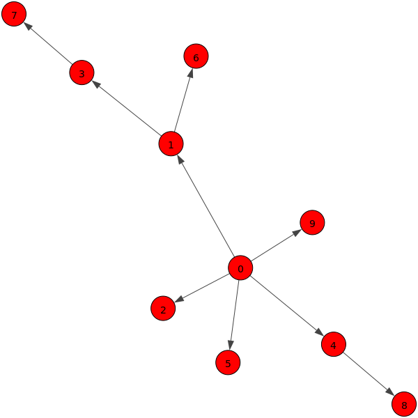

# Building blocks

### Table of Content
* [Introduction](/README.md)
* [Microservice Model](/Docs/MicroserviceModel.md)
  * [Service Cell](/Docs/MicroserviceModel.md#Service-Cell)
  * [Internal Service](/Docs/MicroserviceModel.md#Internal-Service)
  * [External Services](/Docs/MicroserviceModel.md#External-Services)
  * [Custom Functions](/Docs/MicroserviceModel.md#Custom-Functions)
* [**Building Blocks**](/Docs/BuildingBlocks.md)
  * [Service Mesh Generator](/Docs/BuildingBlocks.md#Service-Mesh-Generator)
  * [Work Model Generator](/Docs/BuildingBlocks.md#Work-Model-Generator)
  * [Workload Generator](/Docs/BuildingBlocks.md#Workload-Generator)
  * [Deployment](/Docs/BuildingBlocks.md#Deployment)
    * [Kubernetes](/Docs/BuildingBlocks.md#Kubernetes)
    * [Further Works](/Docs/BuildingBlocks.md#Further-Works)
* [Getting Started](/Docs/GettingStarted.md)
    * [Example](/Docs/GettingStarted.md#Example) - A step by step walkthrough
    * [Autopilot](/Docs/GettingStarted.md#AutoPilot) - The lazy shortcut

---
## The Overview


TODO

Thanks to its modular design you can perform the following steps individually:

1. Create the Microservice Mesh (Service Mesh)
2. Establish the behaviour of each service (Work Model)
3. Combine the Service Mesh and Work Model into K8s deployable YAML files
4. Generate the simulation workload (Work Load Generator)
5. Perform the simulation across the Microservice Mesh
6. Retrieve the simulation data you are interested in

---
## Service Mesh Generator

The ServiceMeshGenerator (`RunServiceMeshGen.py`) generates a .json file that describes the service mesh of the Microservice Application.

### Service Mesh Topology
Literature [studies](https://researchcommons.waikato.ac.nz/bitstream/handle/10289/13981/EVOKE_CASCON_2020_paper_37_WeakestLink.pdf?sequence=11&isAllowed=y) show that the building of a realistic mesh can be done by using the Barabási-Albert (BA) algorithm, which uses a power-law distribution and results in a topology that follows a preferential-attachment model. For this reason we chose to model the service mesh as a BA graph.
If we change the values of the BA model, we are able to generate microservice applications with different mesh topologies. 

The BA algorithm builds the mesh topology as follows: at each step a new service is added as a vertex of a directed tree. This new service is connected with an edge to a single *parent* service already present in the topology. The edge direction is from the parent service to the new *child* service, this means that the parent service includes the new service in its external-services.  
The parent service is chosen according to a preferred attachment strategy using a power-law distribution. Specifically, vertex *i* is chosen as a parent with a (non-normalized) probability equal to *Pi = di^alpha+a*, where *di* is the number of services that have already chosen the service *i* as a parent, *alpha* is the power-law exponent, and *a* is the zero-appeal parameters i.e., the probability of a service being chosen as a parent when no other service has yet chosen it.

### External Service Grouping
To simulate parallel and sequential calls of external-services, the whole set of external-services of a service is organized in a number of `external_service_groups`. Each group contains a different set of external-services and the insertion of external-services in groups is made according to a water-filling algorithm.

### Service execution
When a service request is received, a service executes its internal-service and then the external-services contained in the external-service groups. For each group, a dedicated thread randomly selects `seq_len` external-services from it and invokes (e.g., HTTP call) them sequentially. These threads are executed in parallel, one per group. If the number of external services is less than the configured number of service groups, some service groups do not exist and existing groups contain only a single external-service (water-filling). If the number of external-services in a group is lower than `seq_len`, all external-services in the service group are invoked sequentially. 

### Databases
To simulate the presence of databases in the microservice application, we added to the above topology some *database-services* that only execute their internal service. Other simple services, select one of these databases with a configurable probability.     

### Output Understanding
This is an example of the `servicemesh.json` file generated by the Service Mesh Generator. The related mesh is shown in the .png figure




There are ten services (no databases), `external_service_groups` =2 and `seq_len`= 2. The services have an ID equal to `s{service-number}` (databases too). Each service is a key in the JSON, the value of which is an array. An element of the array describes a group of external-services. In this case, service s0 has five external-services (children) distributed in two groups. The first is composed of services s1,s4,s9; the second, of services s2,s5. Some services are terminal, that is, they do not call any external service, as in the case of services s5,s6,s7,s8,s9.    

```json
{'s0': [{'seq_len': 2, 'services': ['s1', 's4', 's9']},
        {'seq_len': 2, 'services': ['s2', 's5']}],
 's1': [{'seq_len': 2, 'services': ['s3']}, {'seq_len': 2, 'services': ['s6']}],
 's2': [],
 's3': [{'seq_len': 2, 'services': ['s7']}],
 's4': [{'seq_len': 2, 'services': ['s8']}],
 's5': [],
 's6': [],
 's7': [],
 's8': [],
 's9': []}
```


---
## Work Model Generator

The working model defines which internal-services are executed by the Microservice Application services. To allow the continuous integration of new internal services, the internal services are python functions to be placed in python files of the `NFS_SHARED_FOLDER/InternalServiceFunction`. In addition, any service-cell incorporates a default `compute_pi` function that computes a configurable number of python decimal digits. A service uses one of these possible functions as an internal-service, and the choice is made during generation of the working model file according to configurable probabilities that can be given to any python function.

### Internal-service model
A function that implements an internal-service can do some work such as, dummy calculations, read/write operations, etc. At the end of these jobs, the function returns a dummy amount of kBytes in a string, which will be sent back to the service caller after both the internal-service and external-services are completed.
Thus, by appropriately designing an internal-service function, we are able to decide what to stress, including the CPU, I/O, or network. 
Each function takes some user-defined parameters as input and must return a string.  

### compute_pi
The built-in function `compute_pi` computes an `N` number of decimals of the π, where `N` is a integer, randomly chosen in an interval [`X`,`Y`] for each execution. The larger the interval, the greater the complexity and the stress on the CPU. After the computation, the `compute_pi` function returns a dummy string made of `B` kBytes, where `B` is a sample of an exponential random variable whose average is the `mean_bandwidth` parameter.    
So the input parameters of `compute_pi` are:
- `"range_complexity": [X, Y]`  
- `"average_bandwidth": value`
    
### Output Undersanding
The `WorkModelGenerator.py` creates the `workmodel.json` file that describes the work model, i.e. which is the internal-service of any service with related parameters.
```json
{ "s0": {"internal-service": 
 { "compute_pi": { 
    "mean_bandwidth": 11,
    "range_complexity": [101, 101]
    }
 }
}
```     
This is an example of a part of a produced `workmodel.json` that related to the service s0. The internal-service of s0 is the function `compute_pi` that takes as input two parameters, namely `mean_bandwidth` and `range_complexity`. Other custom functions stored in python files in `NFS_SHARED_FOLDER/InternalServiceFunction` can use user-defined parameters (see e.g. `colosseum.py` [here](/Docs/MicroserviceModel.md#Custom-Functions)). 

### Input parameters
Edit the `WorkModelParameters.json` file before executing `RunWorkModelGen.py`. We use the next example to explain related parameters.

```json
{
   "WorkModelParameters":{
      "compute_pi":{
         "probability":0.3,
         "mean_bandwidth":11,
         "range_complexity":[101, 101]
      },
      "colosseum": {
         "probability": 0.6
      }
   },
   "ServiceMeshFilePath":"ServiceMeshGenerator/servicemesh.json"
}
```

As input, you must specify in the key `ServiceMeshFilePath` the path of the service mesh json file. Follow [these instructions](/ServiceMeshGenerator/README.md) if you haven't already created the file.

Also, you must specify the key `WorkModelParameters` whose value is the set of internal-service functions with their parameters, which must include the `probability` key. 

For example:
```json
parameters = {"compute_pi": {"probability": 1, "mean_bandwidth": 11, "range_complexity": [101, 101]},
              "custom_function": {"probability": 0.6, "function_param1": 13, "function_param2": 42}
              }

servicemesh_file_path = "../ServiceMeshGenerator/servicemesh.json"
```

---
## Workload Generator

TODO 

The WorkLoadGenerator maps the simulation time steps (in ms) with the services, or rather, with the probability a certain service may execute its job.

```json
[
  {"time": 0, "services": {"s1": 1, "s2": 0.8}},
  {"time": 2, "services": {"s0": 1}},
  {"time": 5, "services": {"s1": 1, "s2": 0.8}},
  {"time": 7, "services": {"s1": 0.3, "s4": 0.5}},
  {"time": 9, "services": {"s1": 1, "s2": 0.8}},
  {"time": 10, "services": {"s4": 1, "s7": 0.2}}
]
```

---
## Deployment
### Kubernetes

TODO

Up until to now, the deploying part of the MSS requires Kubernetes, but the availability can be expanded in the future. 

#### K8s Yaml Builder
The [K8sYamlBuilder](Kubernetes) comines the `servicemesh.json`, `workmodel.json` and the following input parameters into K8s deployable YAML files:

```shell
prefix_yaml_output_file = "MicroServiceDeployment"
deployment_namespace = "default"
image_name = "lucapetrucci/microservice:latest"
cluster_domain = "cluster"
service_path = "/api/v1"
var_to_be_replaced = {}  # (e.g {"{{string_in_template}}": "new_value", ...} )

nfs_conf = {"address": "10.3.0.4", "mount_path": "/mnt/MSSharedData"}
```

Some changes to the configuration paramteres are mandatory, others optional.
In particular, it is necessary to update the fields regarding the K8s namespace, NFS server address as well as its mounted path, accordingly with your environment.
Concerning the other parameters, we highly suggest changing them only to expert users, since it would require further changes across the code, as well as the rebuilt of the Docker images each services make use of.

As a result, the K8s Yaml Builder creates, on the `Kubernetes/K8sYamlBuilder/yamls` path, one YAML per service with its `Deployment` and its relating `Service`, along with other files useful for the overall deployment of the MSS.

```zsh
host@hostname:~/MicroServiceSimulator/Kubernetes/K8sYamlBuilder/yamls$ ls
ConfigMapNginxGw.yaml
DeploymentNginxGw.yaml
MicroServiceDeployment-s0.yaml
MicroServiceDeployment-s1.yaml
MicroServiceDeployment-s2.yaml
MicroServiceDeployment-s3.yaml
MicroServiceDeployment-s4.yaml
PersistentVolumeMicroService.yaml
```

### Further Works

TODO