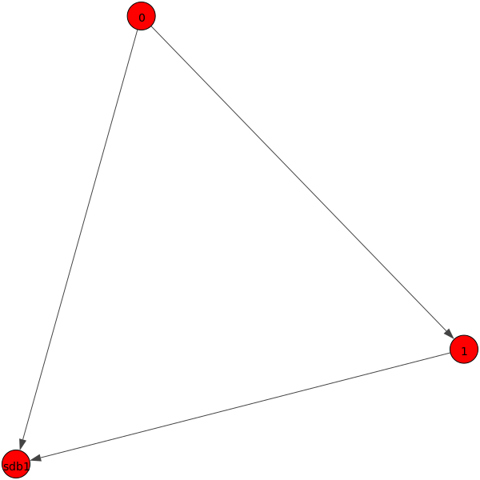
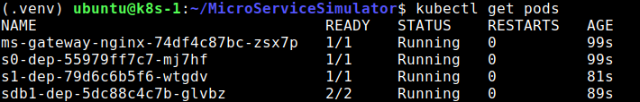
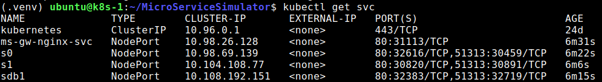
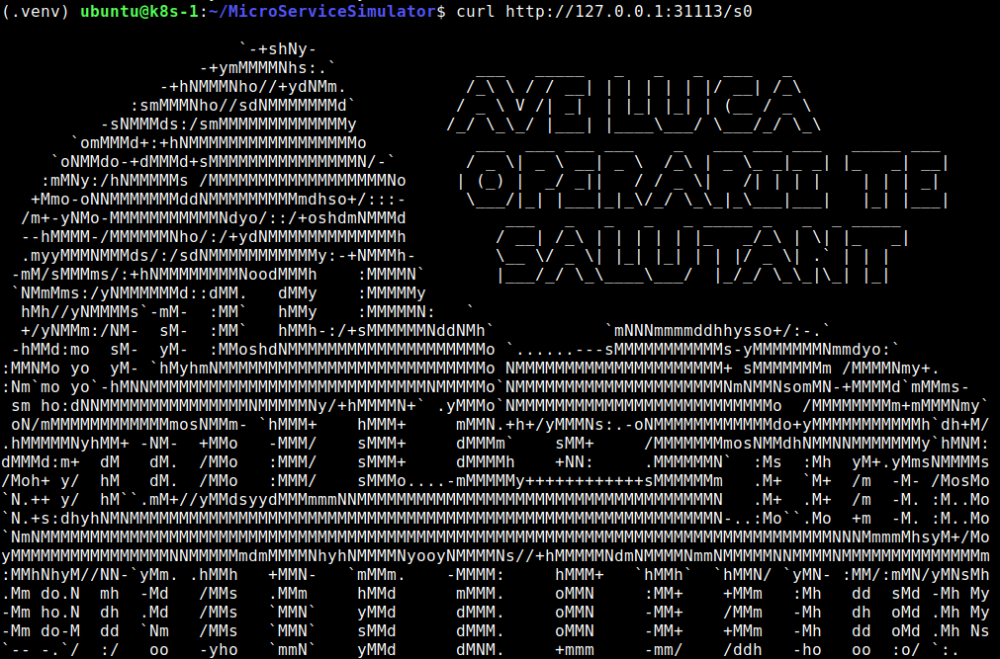

# µBench Manual

- [µBench Manual](#µbench-manual)
  - [Microservice Model](#microservice-model)
  - [Service-Cell](#service-cell)
  - [Work Model](#work-model)
  - [Internal-Service functions](#internal-service-functions)
  - [Application Deployment](#application-deployment)
    - [Kubernetes Deployer](#kubernetes-deployer)
  - [Toolchain](#toolchain)
    - [Service Mesh Generator](#service-mesh-generator)
    - [Work Model Generator](#work-model-generator)
    - [Autopilots](#autopilots)
  - [Benchmark tools](#benchmark-tools)
  - [Monitoring with Prometheus](#monitoring-with-prometheus)
  - [Getting Started](#getting-started)

## Microservice Model


µBench models a microservice application as a complex system made up of services with a different ID, e.g. *s0, s1, s2, sdb1, ... etc*. The task of each service consists in: 

- executing an *internal-service*, i.e. a function, that stresses specific *computing* resources (CPU, disk, memory, etc.) and produces some dummy bytes to stress *network* resources
- calling a set of *external-services*, i.e.  the services of other service-cells, and wait for their results
- sending back the number of dummy bytes produced by the internal-service to the callers

Services communicate with each other using either HTTP REST request/response mechanisms or gRPC. Users can access the µBench microservice application through an API gateway, an NGINX server, that exposes an HTTP endpoint per service, e.g. *NGINX_ip:port/s0*, *NGINX_ip:port/s1*, etc. These endpoints can be used by software for performance evaluation that loads the system with service requests, such as our [Runner](/Docs/BuildingTools.md#Runner).
Service-cells report their observed performance to a global [Prometheus](/Monitoring/README.md#Prometheus) monitoring system. The underlying platform (e.g. Kubernetes) running the µBench microservice application can report its metrics to Prometheus too.

---

## Service-Cell


Each service is implemented by a software unit that we call *service-cell*. A service-cell is a [Docker container](/MicroServiceCellAbstraction/README.md) which contains a Python code executing the internal and external services that the user has chosen for the specific service-cell. 

Service-cells are connected by a TCP/IP network and they access a common storage space (e.g., a Kubernetes Volume) where they find some files describing the work that each of them has to do. These files are `workmodel.json`, and a set of python files imported by the service-cell that include the definition of all *custom functions* possibly used as internal-service.

For performance monitoring, service-cells expose a set of metrics to a Prometheus server.

> Note: A service cell is a single Python process so even if the process is multi-threaded, it only loads a single CPU. 

---

## Work Model

The description of a µBench application, i.e. the set of internal and external services run by service-cells, is contained in a global file named `workmodel.json`, which all service-cells access via a NFS [shared folder](/Docs/NFSConfig.md) (e.g., `/kubedata/mubSharedData/`), internally mounted by the container runtime as storage volume. This configuration mechanism, which exploits the sharing of global files, allows a service-cell to initialize and specialize autonomously, without the aid of a configuration server, a feature that makes it possible to exploit the replication and fault management mechanisms offered by container orchestration platforms such as Kubernetes. We point out a slight analogy of our architecture with that of human cells, which are equal to each other, contain the entire DNA (our configuration files), and are also able to characterize themselves and perform specific tasks.
The `workmodel.json` file describing a µBench application is made by a key per service as shown below.

```json
{
  "s0": {
    "external_services": [
      {
        "seq_len": 100,
        "services": [
          "s1"
        ]
      },
      {
        "seq_len": 1,
        "services": [
          "sdb1"
        ]
      }
    ],
    "internal_service": {
      "compute_pi": {
        "mean_bandwidth": 10,
        "range_complexity": [
          50,
          100
        ]
      }
    },
    "request_method": "rest",
    "workers": 4,
    "threads": 16,
    "url": "s0.default.svc.cluster.local",
    "path": "/api/v1",
    "image": "msvcbench/microservice_v2:latest",
    "namespace": "default"
  },
  "sdb1": {
    "external_services": [],
    "internal_service": {
      "compute_pi": {
        "mean_bandwidth": 1,
        "range_complexity": [
          1,
          10
        ]
      }
    },
    "request_method": "rest",
    "workers": 4,
    "threads": 16,
    "url": "sdb1.default.svc.cluster.local",
    "path": "/api/v1",
    "image": "msvcbench/microservice_v2:latest",
    "namespace": "default"
  },
  "s1": {
    "external_services": [
      {
        "seq_len": 100,
        "services": [
          "s2"
        ]
      }
    ],
    "internal_service": {
      "colosseum": {
        "mean_bandwidth": 10
      }
    },
    "request_method": "rest",
    "workers": 4,
    "threads": 16,
    "url": "s1.default.svc.cluster.local",
    "path": "/api/v1",
    "image": "msvcbench/microservice_v2:latest",
    "namespace": "default"
  },
  "s2": {
    "external_services": [
      {
        "seq_len": 1,
        "services": [
          "sdb1"
        ]
      }
    ],
    "internal_service": {
      "compute_pi": {
        "mean_bandwidth": 15,
        "range_complexity": [
          10,
          20
        ]
      }
    },
    "request_method": "rest",
    "workers": 4,
    "threads": 16,
    "url": "s1.default.svc.cluster.local",
    "path": "/api/v1",
    "image": "msvcbench/microservice_v2:latest",
    "namespace": "default"
  }
}
```

In this example, the µBench application is made by four services: *s0*, *s1*, *s2*, and *sdb1* (that mimics a database). The internal-service of s0 is the function  *compute_pi* with parameters `range_complexity` (uniform random interval of number of pigreco digits to generate; the higher this number the higher the CPU stress) and `mean_bandwidth` (average value of an expneg distribution used to generate the number of bytes to return to the caller).

The external-services called by s0 are organized in two *external-service-groups* described by JSON objects contained by an array. The first group contains only the external-service *s1*. The second group contains only the external-service *sdb1*. To mimic random paths on the service mesh, for each group, a dedicated processing thread of the service-cell randomly selects `seq_len` external-services from it and invokes (e.g., HTTP call) them *sequentially*. These per-group threads are executed in parallel, one per group. In this way, a service-cell can emulate sequential and parallel calls of external-services.

The IP address of a service-cell is associated with a `url` and its service can be (internally) requested on a specific `path` of that URL. For instance, the service *s0* is called by other services by using http://s0.default.svc.cluster.local/api/v1. Additional information includes the Docker `image` to use for the service-cell, the number of parallel processes (`workers`) and `threads` per process used by the service cell to serve client requests, the `request_method` it uses to call other services (can be `gRPC` or `rest` and, currently, must be equal for all), additional variables (e.g., `namespace`) that underlying execution platform can use. 

---

## Internal-Service functions

An internal-service is a function that users can define as a Python function to be inserted in the [shared folder](/Docs/NFSConfig.md) `/kubedata/mubSharedData/InternalServiceFunctions`. The Docker image of the service-cell provides a default function named `compute_pi` that computes a configurable number of decimals of pigreco to keep the CPU busy. 
To stress other aspects (e.g. memory, storage, etc.), the user can develop his *custom functions* and save them into files of the subfolder `InternalServiceFunctions` inside the NFS shared directory. In this way, µBench supports the continuous integration of new benchmark functions without the need of changing the remaining code.

### How to write your own custom function <!-- omit in toc -->

As **input**, your function receives a dictionary with the parameters specified in the `workmodel.json` file.

As **output**, your function must return a string used as body for the response given back by a service.

> Note1: each custom function must have a **unique name**, otherwise conflicts will occur.
Also, you can specify more than one custom function inside the same python file.
> Note2: the python libraries (imports) needed to the custom function must be included in the service-cell container. If necessary edit the `requirement.txt` file of `ServiceCell` and rebuild the container. Then, push it to your own repository, and use this new image in `Configs/K8sParameters.json`. 

```python
def custom_function(params):
    
    ## your code here

    ## the response of the function must be a string
    response_body = "the body must be a string"

    return response_body
```

### compute_pi <!-- omit in toc -->

The built-in function `compute_pi` computes an `N` number of decimals of the *π*, where `N` is an integer, randomly chosen in an interval [`X`,`Y`] for each execution. The larger the interval, the greater the complexity and the stress on the CPU. After the computation, the `compute_pi` function returns a dummy string made of `B` kBytes, where `B` is a sample of an exponential random variable whose average is the `mean_bandwidth` parameter.

So the input parameters of `compute_pi` are:

- `"range_complexity": [X, Y]`  
- `"average_bandwidth": value`

Some custom functions are in the `CustomFunction` folder that contains also related [Readme](CustomFunctions/README.md) documentation. 

### Real Internal-Service functions <!-- omit in toc -->

µBench can support the execution of real software within a service-cell by using *sidecar* containers that share the namespaces with the main container of the service-cell. For instance, a user can include a MongoDB database in the *sdb1* service changing the `workmodel.json` as follows:

```json
  "sdb1": {
    "external_services": [],
    "sidecar": "mongodb",
    "internal_service": {
      "mongo_fun": {
        "nreads": [10,20],
        "nwrites": [10,20]
      }
    }
```

where `sidecar` is the name of the docker image to be used as sidecar and `mongo_fun` is a possible (TODO) function executed by the service-cell as internal-service, which interacts with the sidecar mongoDB by executing a random number of reading and writing operations within the uniform interval 10,20. However, any internal-service function can be used.  

---

## Application Deployment

<p align="center">

</p>

µBench exploits an underlying container orchestration platform to deploy the service-cells. The deployment task is done by a per-platform deployment tool that takes as input the `workmodel.json`, possible platform configuration files, and eventually uses the platform API to carry out the final deployment. Currently, µBench software includes a Kubernetes deployment tool, named K8sDeployer.

### Kubernetes Deployer

The K8sDeployer uses the `workmodel.json` file and other config files to build YAML files of the service-cells and then to deploy them on a Kubernetes platform. The K8SDeployer creates also the shared Volume that contains the `workmodel.json` file and the definition of custom functions, and deploys also the NGINX API gateway.

In particular, the K8sDeployer starts up the following Kubernetes resources:

- A `PersistentVolume` with its `PersistentVolumeClaim` to make the [NFS shared directory](/Docs/NFSConfig.md) visible as a volume for each pod, as it contains the configuration files;
- The NGINX gateway as a `Deployment`, reachable from the outside of the cluster thanks to its related `NodePort` service; the configuration of the NGINX gateway through a `ConfigMap`;
- Each service-cell is a `Deployment` with an associated `NodePort` service.

The K8sDeployer takes as input a json file as the following one which contains information about the IP address and path of NFS server on the K8s Master node used by the service-cells' Volume; the path of the `workmodel.json` file (`WorkModelPath`) and custom functions (`InternalServiceFilePath`) to be stored in the volume, and Kubernetes parameters. The Kubernetes parameters are the Docker `image` of the service-cell, the `namespace` of the deployment, as well as the K8s `cluster_domain` and the `path` used to triggers the service. Some information, such as `image` and `path`, can be already contained in the `workmodel.json` file and, if different, will be overwritten.
The user can change the name of the output YAML files by specifying the `prefix_yaml_file` and these files will be inserted in the `OutputPath` directory.

```json
{
   "K8sParameters": {
      "prefix_yaml_file":"MicroServiceDeployment",
      "namespace": "default",
      "image": "msvcbench/microservice_v2:latest",
      "cluster_domain": "cluster",
      "path": "/api/v1"
   },
   "NFSConfigurations": {
      "address": "192.168.0.46",
      "mount_path": "/kubedata/mubSharedData"
   },
   "InternalServiceFilePath": "CustomFunctions",
   "OutputPath": "SimulationWorkspace",
   "WorkModelPath": "SimulationWorkspace/workmodel.json"
}
```

Run`RunK8sDeployer.py` from the K8s Master node as follows

```zsh
python3 Deployers/K8sDeployer/RunK8sDeployer.py -c Configs/K8sParameters.json
```

If the K8sDeployer found YAML files in the YAML folder, it will ask whether the user prefers to undeploy them before proceeding.

Take care of controlling the eventual completion of the deployement/undeployment operation with `kubectl get pods` command.

---

## Toolchain

To simulate large microservice applications, µBench provides a toolchain made by two software, *ServiceMechGenerator* and *WorkLoadGenerator*, that support the creation of complex `workmodel.json` files by using random distributions whose parameters can be configured by the user.
The following figure shows how they can be sequentially used with the K8sDeployer to have a µBench running on a Kubernetes cluster.


### Service Mesh Generator

The ServiceMeshGenerator generates a random *service mesh* of a µBench microservice application. A service mesh is usually defined as the set of external-services called by each service. It is represented as a graph, whose nodes are the services and a link exists between service A and B if service *A* call service *B*, i.e., *B* is an external-service of *A*. The ServiceMeshGenerator creates a `servicemesh.json` file that includes this topological informations and also other information concerning the strategy used to call the possible external-services, in order to mimic a random traveling of the service-mesh.

#### Service Mesh Topology <!-- omit in toc -->

Literature [studies](https://researchcommons.waikato.ac.nz/bitstream/handle/10289/13981/EVOKE_CASCON_2020_paper_37_WeakestLink.pdf?sequence=11&isAllowed=y) show that the building of a realistic mesh can be done by using the Barabási-Albert (BA) algorithm, which uses a power-law distribution and results in a topology that follows a preferential-attachment model. For this reason, we chose to model the service mesh as a BA graph.
If we change the values of the BA model, we are able to generate microservice applications with different mesh topologies. 

The BA algorithm builds the mesh topology as follows: at each step, a new service is added as a vertex of a directed tree. This new service is connected with an edge to a single *parent* service already present in the topology. The edge direction is from the parent service to the new *child* service, this means that the parent service includes the new service in its external-services.  
The parent service is chosen according to a preferred attachment strategy using a *power-law* distribution. Specifically, vertex *i* is chosen as a parent with a (non-normalized) probability equal to *P<sub>i</sub> = d<sub>i</sub><sup>&alpha;</sup> + a*, where *d<sub>i* is the number of services that have already chosen the service *i* as a parent, *&alpha;* is the power-law exponent, and *a* is the zero-appeal parameters i.e., the probability of a service being chosen as a parent when no other service has yet chosen it.

#### Service Mesh Travel Strategy <!-- omit in toc -->

To simulate parallel and sequential calls of external-services, the whole set of external-services of a service-cell is organized in  *external-service-groups**. Each group contains a different set of external-services and the insertion of external-services in groups is made according to a water-filling algorithm.
When a service request is received, a service executes its internal-service and then the external-services contained in the external-service groups. For each group, a dedicated thread randomly selects `seq_len` external-services from it and invokes (e.g., HTTP call) them sequentially. These threads are executed in parallel, one per group. If the number of external-services is less than the configured number of service groups, some service groups do not exist and existing groups contain only a single external-service (water-filling). If the number of external-services in a group is lower than `seq_len`, all external-services in the service group are invoked sequentially.

#### Databases <!-- omit in toc -->

To simulate the presence of databases in a µBench microservice application, we added to the above topology some *database-services* that only execute their internal-service. The other services, select one of these databases with a configurable probability.

#### Execution <!-- omit in toc -->

The ServicMeshGenrator takes as input a json configuration file (`ServiceMeshParameters.json`) as the following one:

```json
{
   "ServiceMeshParameters": {
      "vertices": 2,
      "external_service_groups": 1,
      "power": 0.05,
      "seq_len": 100,
      "zero_appeal": 3.25,
      "dbs": {
         "nodb": 0.2,
         "sdb1": 0.79,
         "sdb2": 0.01
      }
   },
   "OutputPath": "SimulationWorkspace",
   "OutputFile": "servicemesh.json"
}
```

There are two services (`vertices = 2`), each service has a single `external_service_groups=1`, and for each group `seq_len=100` external-services are sequentially called (when `seq_len` > `vertices` all external-service of a service group are sequentially called).

The configuration allows also the presence of two database, `sdb1` and `sdb2`. sdb1 is used by a service with probability 0.79, `sdb2` with probability 0.01, in the remainig cases the service doent use any database.

The figure below reports a possible service mesh generated with these parameters where `sdb2` has been never chosen by services and therefore not included in the microservice application.

<p align="center">

</p>

The ServiceMeshGenerator generates and saves to the `OutputPath` directory two files: the `servicemesh.json` and the `servicemesh.png` for easier visualization of the generated service mesh, like the one shown before. The name of these files can be changed with the key `OutputFile`.

This is an example of the `servicemesh.json` file generated by the ServiceMeshGenerator. The related mesh is shown in the above figure. We note that this is a part of the `workmodel.json` file previously presented. The other part will be created by the WorkModelGenerator.

```json
{
  "s0": {
    "external_services": [
      {
        "seq_len": 100,
        "services": [
          "s1"
        ]
      },
      {
        "seq_len": 1,
        "services": [
          "sdb1"
        ]
      }
    ]
  },
  "sdb1": {
    "external_services": []
  },
  "s1": {
    "external_services": [
      {
        "seq_len": 1,
        "services": [
          "sdb1"
        ]
      }
    ]
  }
}
```

To run `ServiceMeshGenerator` execute

```zsh
python3 ServiceMeshGenerator/RunServiceMeshGen.py -c Configs/ServiceMeshParameters.json
```

#### Examples <!-- omit in toc -->

We illustrate four examples of different service mesh topologies:

##### An highly-centralized hierarchical architecture with most of the services linked to one service (excluded the db services): <!-- omit in toc -->

```json
{
   "ServiceMeshParameters":{
      "external_service_groups":1,
      "seq_len":1,
      "vertices":10,
      "power":0.05,
      "zero_appeal":0.01,
      "dbs":{
         "nodb":0.2,
         "sdb1":0.6,
         "sdb2":0.4
      }
   },
   "OutputPath": "SimulationWorkspace",
   "OutputFile": "servicemesh.json"
}
```

<p align="center">

</p>

##### An applications that rely on a common logging service <!-- omit in toc -->

```json
{
   "ServiceMeshParameters":{
      "external_service_groups":1,
      "seq_len":1,
      "vertices":10,
      "power":0.9,
      "zero_appeal":0.01,
      "dbs":{
         "nodb":0.2,
         "sdb1":0.6,
         "sdb2":0.4
      }
   },
   "OutputPath": "SimulationWorkspace",
   "OutputFile": "servicemesh.json"
}
```

<p align="center">

</p>

##### An application with several auxiliary services: <!-- omit in toc -->

```json
{
   "ServiceMeshParameters":{
      "external_service_groups":1,
      "seq_len":1,
      "vertices":10,
      "power":0.05,
      "zero_appeal":3.25,
      "dbs":{
         "nodb":0.2,
         "sdb1":0.6,
         "sdb2":0.4
      }
   },
   "OutputPath": "SimulationWorkspace",
   "OutputFile": "servicemesh.json"
}
```

<p align="center">

</p>

##### An application organized in the conventional multi-tier fashion: <!-- omit in toc -->

```json
{
   "ServiceMeshParameters":{
      "external_service_groups":1,
      "seq_len":1,
      "vertices":10,
      "power":0.9,
      "zero_appeal":3.25,
      "dbs":{
         "nodb":0.2,
         "sdb1":0.6,
         "sdb2":0.4
      }
   },
   "OutputPath": "SimulationWorkspace",
   "OutputFile": "servicemesh.json"
}
```

<p align="center">

</p>

### Work Model Generator

The WorkModelGenerator generates the `workmodel.json` describing internal and external-services of service-cells and that is used by deployers to eventually run the microservice application. For the configuration of external-services, the WorkModelGenerator imports those specified in a `servicemesh.json` file manually made of automatically generated by the ServiceMeshGenerator. For the selection of functions to be associated with internal-services of service-cells, the WorkModelGenerator singles out these functions at random and according to configurable probabilities. 

The WorkModelGenerator takes as input a configuration file (`WorkModelParameters.json`) as the following one

```json
{
   "WorkModelParameters":{
      "f0":{
         "type": "function",
         "value": {
            "name": "compute_pi",
            "recipient": "service",
            "probability":0,
            "parameters": {
               "mean_bandwidth":10,
               "range_complexity":[50, 100]
            },
            "workers":4,
            "threads":16
         }
      },
      "f1": {
         "type":"function",
         "value":{
            "name": "colosseum",
            "recipient": "service",
            "probability": 0.0,
            "parameters":{},
            "workers":4,
            "threads":16
         }
      },
      "f2": {
         "type":"function",
         "value": {
            "name": "loader",
            "recipient": "database",
            "probability":1,
            "parameters": {
               "cpu_stress": {"run":false,"range_complexity": [100, 100], "thread_pool_size": 1, "trials": 1},
               "memory_stress":{"run":false, "mean_memory_size": 10000, "mean_memory_io": 1000},
               "disk_stress":{"run":true,"tmp_file_name":  "mubtestfile.txt", "disk_write_block_count": 1000, "disk_write_block_size": 1024},
               "mean_bandwidth": 11
            },
            "workers":4,
            "threads":16
         }
      },
      "f3": {
         "type":"function",
         "value": {
            "name": "loader",
            "recipient": "service",
            "probability":1,
            "parameters": {
               "cpu_stress": {"run":true,"range_complexity": [1000, 1000], "thread_pool_size": 1, "trials": 1},
               "memory_stress":{"run":true, "mean_memory_size": 10000, "mean_memory_io": 1000},
               "disk_stress":{"run":false,"tmp_file_name":  "mubtestfile.txt", "disk_write_block_count": 1000, "disk_write_block_size": 1024},
               "mean_bandwidth": 11
            },
            "workers":4,
            "threads":16
         }
      },
      "request_method":{
         "type": "metadata",
         "value":"rest"
      },
      "databases_prefix": {
         "type":"metadata",
         "value": "sdb"
      },
      "override": {
         "type": "metadata",
         "value": {
            "sdb1": {"sidecar": "mongo:4.4.9"},
            "s0": {"function_id": "f1"}
         }
      },
      "ServiceMeshFilePath": {
         "type": "metadata", 
         "value":"SimulationWorkspace/servicemesh.json"
      },
      "OutputPath": {
         "type":"metadata",
         "value":"SimulationWorkspace"
      }
   }
}
```

This file includes a set of function that can be assigned to service-cells with a given probability to implement their internal-service. Many functions (`f0`, `f1`, `f2`,`f3`) can use the same python *base-function* (e.g. `loader` is used by `f2` and `f3` ) but with different parameters. Each function is represented as JSON object with a unique ID key (`f0`, `f1`, `f2`, `f3`) and whose values are: the `parameters` taken as input by the function that are function dependent, , e.g., the `compute_pi` function uses `mean_bandwidth` and `range_complexity`; the `recipient` of the function (`database` or plain `service`);  the `name` of the base-function to be executed (available in Python files of the NFS folder `/kubedata/mubSharedData/`); the `probability` to be associated to a service-cell; the optional keys `workers` and `threads` that are the number of processes and threads per process used by service-cells that run the function to serve client requests; the optional key `replicas` (not shown) for choosing the number of replicas of service-cells that run the function.

The description of external-services is imported through a `servicemesh.json` file located in `ServiceMeshFilePath` metadata that can be manually made or automatically generated by the ServiceMeshGenerator. 

The method used to carry out external-service calls is specified in `request_method` metadata ("rest" or "gRPC"). Prefix to identify databases is in `databases_prefix` metadata.

The `override` metadata can be used to enforce the use of a specific function for a service avoiding the random selection and to assign sidecar containers to a service-cell. In the above example, the service-cell that implements the database identified as `sdb1` has a mongo sidecar container. Moreover, the service-cell that implements the service `s0` uses the function with ID `f1`.  

The final `workmodel.json` file produced by the tool will be saved in the `OutputPath`. The filename `workmodel.json` can be changed with the key `OutputFileName`

To run the `WorkModelGenenerator` launch the following command:

```zsh
python3 WorkModelGenerator/RunWorkModelGen.py -c Configs/WorkModelParameters.json
```

### Autopilots

Autopilots are sequential executors of the toolchain. An autopilot sequentially runs the `ServiceMeshGenerator`, the `WorkModelGenerator`, and the `Deployer`.

#### K8sAutopilot <!-- omit in toc -->

Currently, the `Autopilots` folder contains an Autopilot tool for Kubernetes in the subfolder `K8sAutopilot`. It uses the following configuration `K8sAutopilotConf.json` file whose keys specify the paths of the run tools and their configuration files.

```json
{
   "RunServiceMeshGeneratorFilePath": "ServiceMeshGenerator/RunServiceMeshGen.py",
   "RunWorkModelGeneratorFilePath": "WorkModelGenerator/RunWorkModelGen.py",
   "RunK8sDeployerFilePath": "Deployers/K8sDeployer/RunK8sDeployer.py",
   "ServiceMeshParametersFilePath": "Configs/ServiceMeshParameters.json",
   "WorkModelParametersFilePath": "Configs/WorkModelParameters.json",
   "K8sParametersFilePath": "Configs/K8sParameters.json"
}
```

Run the `K8sAutopilot` with:

```zsh
python3 Autopilots/K8sAutopilot/K8sAutopilot.py -c Configs/K8sAutopilotConf.json
```

---

## Benchmark tools

µBench provides simple benchmark tools in the `Benchmarks` directory. Besides these tools, you can 
use other open-souce tools, e.g. *ab - Apache HTTP server benchmarking tool * as it follows, where 127.0.0.1:31113 should be replaced with the IP address and port of the NGINX API gateway:

```zsh
ab -n 100 -c 2 http://127.0.0.1:31113/s0
```

### Traffic Generator and Runner <!-- omit in toc -->

`TrafficGenerator` and `Runner` are two tools used to load a µBench microservice application with a sequence of HTTP requests and observe its performance both through simple metrics offered by the Runner and by Prometheus metrics.  

#### Runner <!-- omit in toc -->

The `Runner` is the tool that loads the application with HTTP requests.
It can work in two ways: `file` and `greedy`

In `file` mode, the `Runner` takes as input one or more *workload* description files whose lines describe the request events, in terms of time and identifiers of the service to be called. We can see an example of a workload file below.

```json
[
  {"time": 100, "service": "s0"},
  {"time": 200, "service": "s0"},
  {"time": 500, "service": "s0"},
  {"time": 700, "service": "s0"},
  {"time": 900, "service": "s0"},
  {"time": 1000, "service": "s0"}
]
```

The `Runner` schedules the events defined in the workload files and then uses a thread pool to execute HTTP requests to the related services through the NGINX access gateway of the µBench microservice application.

In `greedy` mode, the `Runner` allocates a pool of threads. Each thread makes an HTTP request to the service `s0`; when the response is received, the thread immediately send another request.     

To Runner takes as input the `RunnerParameters.json` as the following one.

```json
{
   "RunnerParameters":{
      "ms_access_gateway": "http://<access-gateway-ip>:<port>",
      "workload_type": "file",
      "workload_files_path_list": ["/path/to/workload.json"],
      "workload_rounds": 1,
      "thread_pool_size": 4,
      "workload_events": 100,
      "result_file": "result.txt"
   },
   "OutputPath": "SimulationWorkspace",
   "AfterWorkloadFunction": {
   "file_path": "Function",
   "function_name": "get_prometheus_stats"
   }
}
```

The HTTP requests are sent towards the services of the µBench application through the NGINX access gateway, whose IP address is specified in the `ms_access_gateway` parameter.

The runner mode is specified in the `workload_type` parameter and can be `file` or `greedy`.

In `file` mode, the workload files can be specified into the `workload_files_path_list` parameter as the path of a single file or as the path of a directory where multiple workload files are saved. In this way, you can simulate different workload scenarios one after the other.
The `Runner` sequentially executes one by one these files and saves a test result file whose name is in the value of `result_file` key and the output directory is the value of `OutputPath` key. 
Also, you can specify how many times you want to cycle through the workload directory with the `workload_rounds` parameter, as well as the size of the thread pool allocated for each test with `thread_pool_size`. The parameter `workload_events` is not used for `file` mode.

In `greedy` mode, the threads of the pool send a number of `workload_events` HTTP requests before terminating the test. The paramenters `workload_files_path_list` and `workload_rounds` are not used for greedy mode.

After each test, the `Runner` can execute a custom python function (e.g. to fetch monitoring data from Prometheus) specified in the key `file_name`, which is defined by the user in a file specified into the `file_path` key.

The `result_file` produced by the `Runner` contains three columns: the first one indicates the time of the execution of the request as a unix timestamp; the second column indicates the elapsed time, in *ms*, of the request; the third column reports the received HTTP status (e.g. 200 OK).

```bash
1622712602765    0.163079   200
1622712603940    0.158704   200      
1622712604272    0.147043   200
1622712605857    0.14741    200
1622712606245    0.155425   200
1622712606612    0.161511   200
1622712606972    0.15307    200
1622712607343    0.157438   200
1622712607520    0.147363   200
1622712607593    0.192539   200
...
```

The `Runner` can be executed by using:

```zsh
python3 Benchmarks/Runner/Runner.py -c Configs/RunnerParameters.json
```

> We recommend executing the `Runner` outside the nodes of the cluster where the microservices application is running, with the purpose of not holding resources from the running services and bias the test results.

#### TrafficGenerator <!-- omit in toc -->

The `TrafficGenerator` is a tool for generating a `workload.json` file for the `Runner` by using an exponential distribution for requests' inter-arrival times.
It requires as input a `TrafficGeneratorParameters.json` file as the following one:

```json
{
   "TrafficParameters":{
      "ingress_service":"s0",
      "request_parameters": {
         "mean_interarrival_time": 500,
         "stop_event": 1000
      }
   },
   "OutputPath": "SimulationWorkspace",
   "OutoutFile": "workload.json"
}
```

The `ingress_service` parameter indicates the name of the service that acts as the ingress service of the microservice, in this example `s0`.  
As `request_parameters`, you need to specify the mean inter-arrival times in ms (`mean_interarrival_time`) and the number of requests (`stop_event`).
The `TrafficGenerator` will generate a file called `workload.json` and it will save it to the path specified from the `OutputPath` parameter.

The `TrafficGenerator` can be executed as follows:

```zsh
python3 Benchmarks/TrafficGenerator/RunTrafficGen.py -c Configs/TrafficParameters.json
```

With the following steps, you will deploy on your Kubernetes environment: [Prometheus](https://prometheus.io/), [Prometheus Adapter](https://github.com/kubernetes-sigs/prometheus-adapter) and [Grafana](https://grafana.com/)

---

## Monitoring with Prometheus

µBench service-cells export some metrics to a Prometheus server running in the cluster.

### Cluster Configuration <!-- omit in toc -->

First, create a new namespace called `monitoring` where we will deploy all the monitoring resources. Prometheus will be available at: `http://<access-gateway-ip>:30000` after the successful deployment of the following commands:

```bash
kubectl create namespace monitoring
kubectl apply -f Monitoring/kubernetes-prometheus
```

#### Prometheus Adapter <!-- omit in toc -->

Prometheus Adapter is suitable for use with the [Kubernetes Horizontal Pod Autoscaler](https://kubernetes.io/docs/tasks/run-application/horizontal-pod-autoscale/).
It can also replace the metrics server on clusters that already run Prometheus and collect the appropriate metrics.
You can install it using [Helm](https://helm.sh/docs/intro/install/).
We'll use the `prometheus-adapter-values.yaml` file for defining the µBench custom metrics to analyze.

```bash
helm repo add prometheus-community https://prometheus-community.github.io/helm-charts
helm repo update
helm install --namespace monitoring -f kubernetes-prometheus-adapter/prometheus-adapter-values.yaml prometheus-adapter prometheus-community/prometheus-adapter

# to check the status of the release
$ helm status prometheus-adapter --namespace monitoring
```

#### Grafana  <!-- omit in toc -->

Prometheus metrics can be shown by using [Grafana](https://grafana.com/) tool.
To install Grafana in the Kubernetes cluster you can use the following command and Grafana services will be available at: `http://<access-gateway-ip>:30001`

```bash
kubectl create namespace monitoring
kubectl apply -f Monitoring/kubernetes-grafana
```

### Service Cell metrics <!-- omit in toc -->

A service-cell exports the following Prometheus Summary metrics:

- *mub_response_size* : size of the request response in bytes;
- *mub_request_latency_seconds* : request latency including the execution of internal and extrenal services;
- *mub_internal_processing_latency_seconds* : duration of the execution of the internal-service
- *mub_external_processing_latency_seconds* :  duration of the execution of the external-service

---

## Getting Started

In this section, we describe how to deploy a µBench example application and make a simple performance test. We use the configuration files contained in the `Config` directory.

### Step 1 - Platform Configuration <!-- omit in toc -->

- Obtain access to a Kubernetes platform with [NFS](Docs/NFSConfig.md) and Prometheus (#monitoring-with-prometheus) installed.
- Install Python3 on the master node
- Clone the git repository of µBench on Kubernetes master node and move in the  MicroServiceSimulator dir
  
  ```zsh
  git clone https://github.com/mSvcBench/MicroServiceSimulator.git
  cd MicroServiceSimulator
```

- Create and activate a Python virtual environment, and install required modules

```zsh
python3 -m venv .venv

source .venv/bin/activate

pip3 install -r requirements.txt
```

### Step 2 -  Service mesh generation <!-- omit in toc -->

Generate the [service mesh](#service-mesh-generator) and obtain two files `servicemesh.json` and `servicemesh.png` in the `SimulationWorkspace` dir. The .png is a picture of the generated mesh. 

```zsh
python3 ServiceMeshGenerator/RunServiceMeshGen.py -c Configs/ServiceMeshParameters.json
```

### Step 3: Work model generation <!-- omit in toc -->

Generate the [work model](#work-model) and obtain the `workmodel.json` file in the `SimulationWorkspace` dir.

```zsh
python3 WorkModelGenerator/RunWorkModelGen.py -c Configs/WorkModelParameters.json
```

### Step 4: Deploy on Kubernetes <!-- omit in toc -->

Deploy the service-cells on Kubernetes and manually monitor that all pods are Running 

```zsh
python3 Deployers/K8sDeployer/RunK8sDeployer.py -c Configs/K8sParameters.json

kubectl get pods
```

In this figure, we see a µBench application made of two services (s0 and s1), a database (sdb1) and the nginx access gateway

<p align="center">

</p>  

Discover the TCP port of the access gateway (default 31113)

```zsh
kubectl get pods svc
```

<p align="center">

</p>  

> Note that steps 2,3,4 can be performed all at once by using the [Kubernetes Autopilot](#k8sautopilot)

### Step 5: Test service response <!-- omit in toc -->

Test the correct execution of the application with (127.0.0.1 can be replaced with the public IP address of master node)

```zsh
curl http://127.0.0.1:31113/s0
```

<p align="center">

</p>

For other tests refer to [Benchmarks](#benchmarks-tools) tools.
