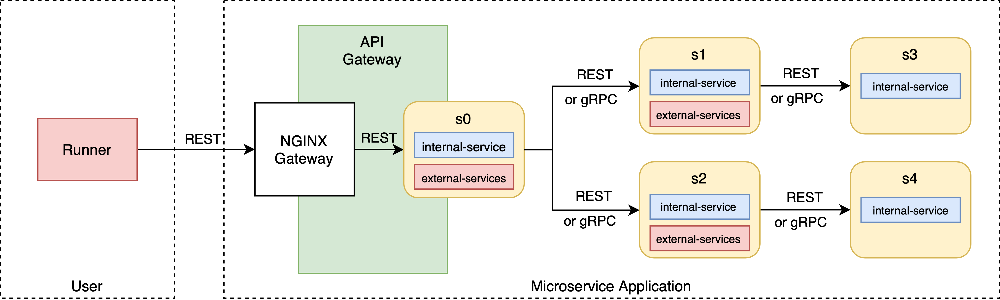
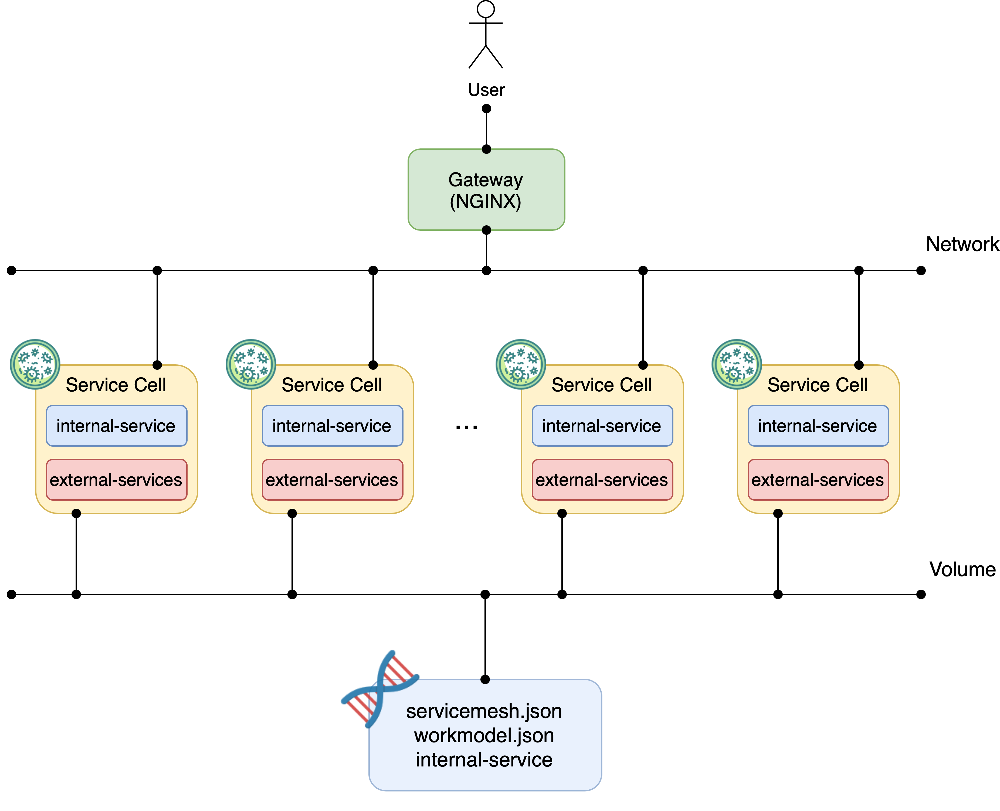
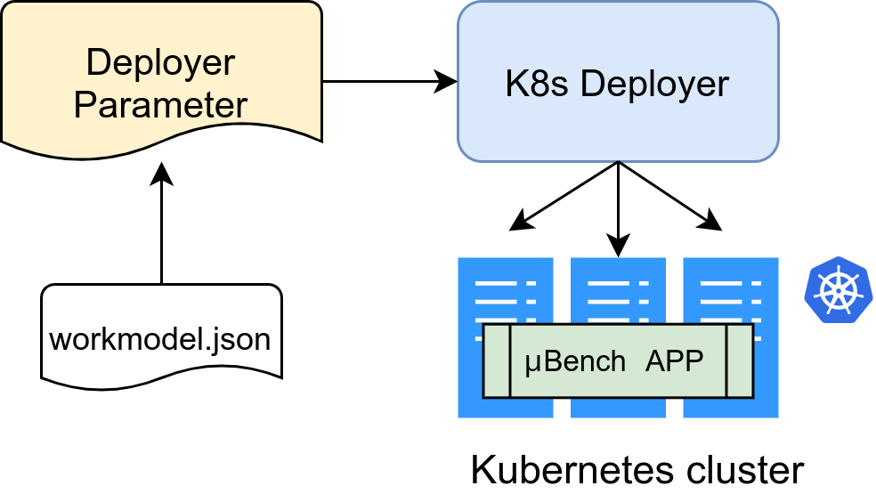
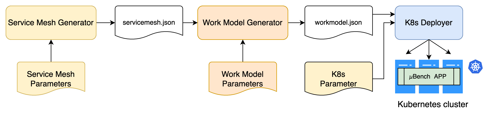
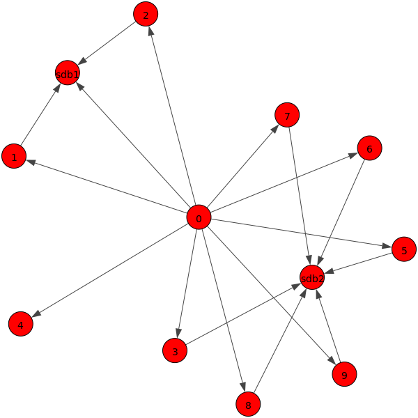
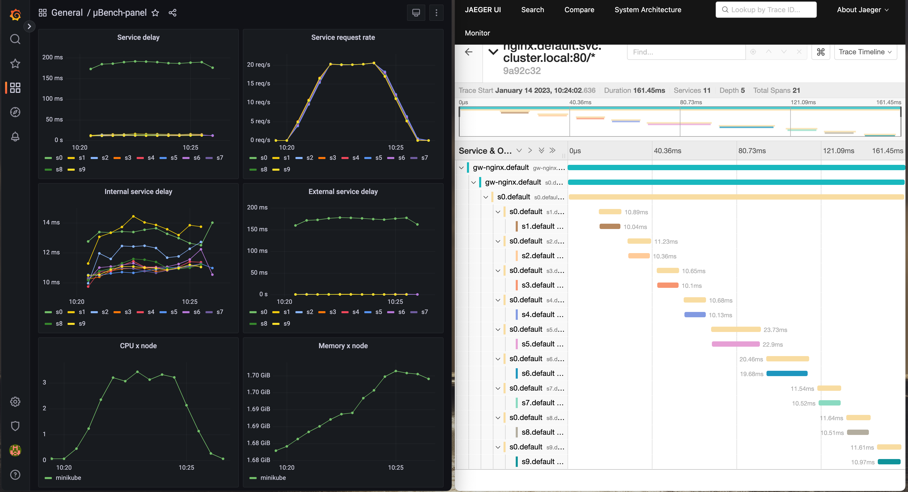
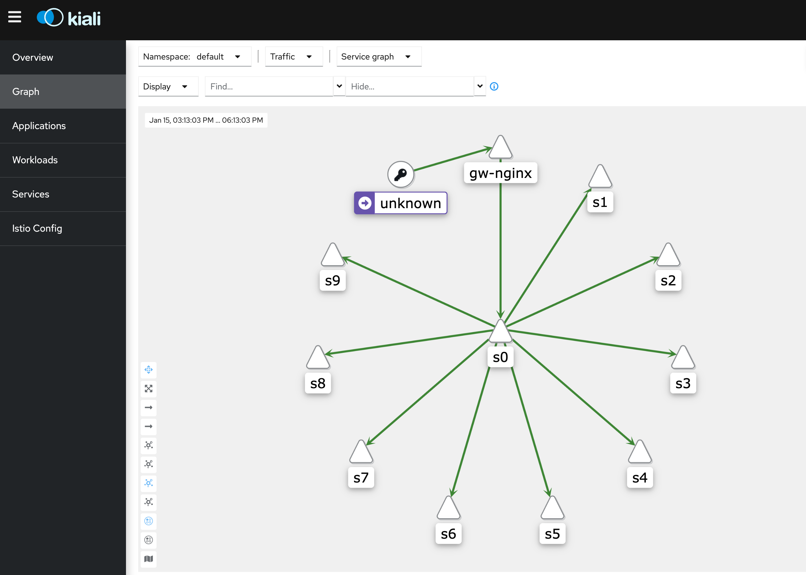

Here is the revised full manual for µBench:

# µBench Manual

- [µBench Manual](#µbench-manual)
  - [Microservice Model](#microservice-model)
  - [Service-Cell](#service-cell)
  - [Work Model](#work-model)
  - [Internal-Service Functions](#internal-service-functions)
    - [How to Write Your Own Custom Function](#how-to-write-your-own-custom-function)
    - [compute\_pi](#compute_pi)
    - [Real Internal-Service Functions](#real-internal-service-functions)
  - [Run a µBench Application](#run-a-µbench-application)
    - [Execute a µBench Application in a Kubernetes Cluster](#execute-a-µbench-application-in-a-kubernetes-cluster)
  - [Toolchain](#toolchain)
    - [Service Graph Generator](#service-graph-generator)
      - [Concepts](#concepts)
      - [Execution of the ServiceGraphGenerator](#execution-of-the-servicegraphgenerator)
      - [Examples](#examples)
        - [An Highly Centralized Hierarchical Architecture with Most of the Services Linked to One Service (Excluding the DB Services):](#an-highly-centralized-hierarchical-architecture-with-most-of-the-services-linked-to-one-service-excluding-the-db-services)
        - [An Application that Relies on a Common Logging Service:](#an-application-that-relies-on-a-common-logging-service)
        - [An Application with Several Auxiliary Services:](#an-application-with-several-auxiliary-services)
        - [An Application Organized in the Conventional Multi-Tier Fashion:](#an-application-organized-in-the-conventional-multi-tier-fashion)
    - [Work Model Generator](#work-model-generator)
    - [Autopilots](#autopilots)
      - [K8sAutopilot](#k8sautopilot)
  - [Benchmark Strategies](#benchmark-strategies)
    - [Stochastic-Driven Benchmarks](#stochastic-driven-benchmarks)
    - [Trace-Driven Benchmarks](#trace-driven-benchmarks)
      - [Alibaba-Derived Traces](#alibaba-derived-traces)
  - [Benchmark Tools](#benchmark-tools)
    - [Traffic Generator and Runner](#traffic-generator-and-runner)
      - [Runner](#runner)
      - [TrafficGenerator](#trafficgenerator)
  - [Monitoring and Tracing](#monitoring-and-tracing)
  - [Installation and Getting Started](#installation-and-getting-started)
    - [Create and Access a Kubernetes Cluster](#create-and-access-a-kubernetes-cluster)
      - [Minikube](#minikube)
      - [Production Environment](#production-environment)
    - [Install µBench Software](#install-µbench-software)
      - [µBench in a Docker Container](#µbench-in-a-docker-container)
      - [µBench in the Host](#µbench-in-the-host)
    - [Install and Access the Monitoring Framework](#install-and-access-the-monitoring-framework)
    - [My First µBench Application](#my-first-µbench-application)
    - [µBench Custom Applications](#µbench-custom-applications)
      - [Service Graph Generation](#service-graph-generation)
      - [Work Model Generation](#work-model-generation)
      - [Execution on Kubernetes](#execution-on-kubernetes)
    - [Test Service Response](#test-service-response)

## Microservice Model



µBench generates dummy microservice applications consisting of a set of (micro) services that call each other to satisfy a client request. Each service has a different ID (e.g., *s0, s1, s2, sdb1*) and performs the following tasks:

- Executing an *internal-service*, i.e., a function, that stresses specific *computing* resources (CPU, disk, memory, etc.) and produces some dummy bytes to stress *network* resources.
- Calling a set of *external-services*, i.e., the services of other service-cells, and waiting for their results.
- Sending back the number of dummy bytes produced by the internal-service to the callers.

Services communicate with each other using either HTTP REST request/response mechanisms or gRPC. Users can access the µBench microservice application through an API gateway, an NGINX server, that exposes an HTTP endpoint per service, e.g., *NGINX_ip:port/s0*, *NGINX_ip:port/s1*, etc. These endpoints can be used by software for performance evaluation that loads the system with service requests, such as our [Runner](Manual.md#benchmark-tools), [ApacheBench](https://httpd.apache.org/docs/2.4/programs/ab.html), [JMeter](https://jmeter.apache.org/).
µBench services report their observed performance to a global [Prometheus](/Monitoring/kubernetes-prometheus/README.md#Prometheus) monitoring system. The underlying platform (e.g., Kubernetes) running the µBench microservice application can report its metrics to Prometheus too.

---

## Service-Cell



Each service is implemented by a main software unit that we call *service-cell*. A service-cell is a [Docker container](/ServiceCell/README.md) that contains a Python program executing the internal and external services that the user has chosen for the specific service. After the execution of internal and external services, it returns a number of dummy kBytes.

When a service-cell is executed, it has an identifier (e.g., *Sx*) collected from environment variables. It imports the Python files with the code of the *custom functions* (custom internal-services) possibly defined by the user. Then, it reads the `workmodel.json` file to figure out based on its identifier which internal and external services it should execute when serving a request. As described later, the `workmodel.json` file is a kind of "DNA" of a µBench application that describes for each service what local job (internal-service) it must do and what other downstream services it must call (external-services) before sending back a response.

The `workmodel.json` file and the portfolio of Python files with the code of the *custom functions* are imported by the service-cell through specific Kubernetes ConfigMaps.

For performance monitoring, a service-cell exposes a set of [metrics](#monitoring-and-tracing) to a Prometheus server.

Optionally, a µBench service (i.e., a POD) can be associated with a sidecar container that runs a real software, e.g., a database, that interacts with the main container of the service-cell. This way, µBench can be used to evaluate the performance of real software in a microservice architecture.

---

## Work Model

The description of a µBench application, i.e., the set of internal and external-services run by service-cells, is contained in a global file named `workmodel.json`, which all service-cells access via a K8s ConfigMap (named `mub-workmodel`). The `workmodel.json` file is made by a key per service as shown below.

```json
{
   "s0": {
      "external_services": [{
            "seq_len": 100,
            "services": [
               "s1"
            ],
            "probabilities": {
               "s1": 1
            }
         },
         {
            "seq_len": 1,
            "services": [
               "sdb1"
            ],
            "probabilities": {
               "sdb1": 1
            }
         }
      ],
      "internal_service": {
         "compute_pi": {
            "mean_response_size": 10,
            "range_complexity": [
               50,
               100
            ]
         }
      },
      "request_method": "rest",
      "workers": 4,
      "threads": 16,
      "cpu-requests": "1000m",
      "cpu-limits": "1000m",
      "pod_antiaffinity": false,
      "replicas": 1
   },
   "sdb1": {
      "external_services": [],
      "internal_service": {
         "compute_pi": {
            "mean_response_size": 1,
            "range_complexity": [
               1,
               10
            ]
         }
      },
      "request_method": "rest",
      "workers": 4,
      "threads": 16,
      "pod_antiaffinity": false,
      "replicas": 1,
      "cpu-requests": "1000m",
      "cpu-limits": "1000m"
   },
   "s1": {
      "external_services": [{
         "seq_len": 100,
         "services": [
            "s2"
         ],
         "probabilities": {
            "s2": 1
         }
      }],
      "internal_service": {
         "colosseum": {
            "mean_response_size": 10
         }
      },
      "request_method": "rest",
      "workers": 4,
      "threads": 16,
      "cpu-requests": "1000m",
      "cpu-limits": "1000m",
      "pod_antiaffinity": false,
      "replicas": 1
   },
   "s2": {
      "external_services": [{
         "seq_len": 100,
         "services": [
            "sdb1"
         ],
         "probabilities": {
            "sdb1": 1
         }
      }],
      "internal_service": {
         "compute_pi": {
            "mean_response_size": 15,
            "range_complexity": [
               10,
               20
            ]
         }
      },
      "request_method": "rest",
      "workers": 4,
      "threads": 16,
      "cpu-requests": "1000m",
      "cpu-limits": "1000m",
      "pod_antiaffinity": false,
      "replicas": 1
   }
}
```

In this example, the µBench application is made by four services: *s0*, *s1*, *s2*, and *sdb1* (that mimics a database). The internal-service of s0 is the function *compute_pi* with parameters `range_complexity` (uniform random interval of the number of pi digits to generate; the higher this number the higher the CPU stress) and `mean_response_size` (average value of an expneg distribution used to generate the number of bytes to return to the caller).

The external-services called by s0 are organized into two *external-service-groups* described by JSON objects contained in an array. The first group contains only the external-service *s1*. The second group contains only the external-service *sdb1*. External-services belonging to the same group are called sequentially, while those in different groups are called in parallel. Specifically, upon receiving a request, a different per-group thread is executed for each external-service-group. Each per-group thread randomly selects a number of `seq_len` external-services in its group and invokes them (e.g., an HTTP call) sequentially, according to a given calling `probability`. If `seq_len` is greater than the size of the external-services-group, the involvement of the external-services of the group is controlled exclusively by the calling probabilities.

In the considered example, the service *s0* surely calls *s1* because seq_len is greater than the size of the external-service-group and probability of s1 = 1, and for the same reason it surely calls *sdb1* in parallel, because *s1* and *sdb1* belong to different external-service-groups of *s0*. Consequently, *s1* surely calls *s2* and *s2* surely calls *sdb1*.

This way of involving microservices per request is called *stochastic-driven*. µBench also offers a *trace-driven* approach, see [Benchmark Strategies](#benchmark-strategies).

Additional information includes the number of parallel processes (`workers`) and `threads` per process used by the service-cell to serve client requests, the `request_method` it uses to call other services (can be `gRPC` or `rest`, and, currently, must be equal for all), optional specification of CPU and memory resources needed by service-cell containers, namely `cpu-requests`, `cpu-limits`, `memory-requests`, `memory-limits` (see k8s [documentation](https://kubernetes.io/docs/concepts/configuration/manage-resources-containers/)), the number of `replicas` of the related POD, the `pod_antiaffinity` (true, false) property to enforce pods spreading on different nodes.

---

## Internal-Service Functions

An internal-service is a function that users can define as a Python function. The Docker image of the service-cell provides a default function named `compute_pi` that computes a configurable number of decimals of pi to keep the CPU busy.
To stress other aspects (e.g., memory, storage, etc.), the user can develop his *custom functions* and save them into the subfolder `CustomFunctions`. In this way, µBench supports the continuous integration of new benchmark functions without the need to change the remaining code.

### How to Write Your Own Custom Function

As **input**, your function receives a dictionary with the parameters specified in the `workmodel.json` file.

As **output**, your function must return a string used as the body for the response given back by a service.

> Note1: Each custom function must have a **unique name**, otherwise conflicts will occur.
Also, you can specify more than one custom function inside the same Python file.
> Note2: The Python libraries (imports) needed for the custom function must be included in the service-cell container. If necessary, edit the `requirement.txt` file of `ServiceCell` and rebuild the container. Then, push it to your own repository, and use this new image in `Configs/K8sParameters.json`.

```python
def custom_function(params):

    ## your code here

    ## the response of the function must be a string
    response_body = "the body must be a string"

    return response_body
```

### compute_pi

The built-in function `compute_pi` computes an `N` number of decimals of the *π*, where `N` is an integer, randomly chosen in an interval [`X`,`Y`] for each execution. The larger the interval, the greater the complexity and the stress on the CPU. After the computation, the `compute_pi` function returns a dummy string made of `B` kBytes, where `B` is a sample of an exponential random variable whose average is the `mean_response_size` parameter.

So the input parameters of `compute_pi` are:

- `"range_complexity": [X, Y]`
- `"mean_response_size": value`

Some custom functions are already available in the `CustomFunction` folder that contains also related [Readme](CustomFunctions/README.md) documentation.

### Real Internal-Service Functions

µBench can support the execution of real software within a service-cell by using *sidecar* containers that share the namespaces with the main container of the service-cell. For instance, a user can include a MongoDB database in the *sdb1* service by changing the `workmodel.json` as follows:

```json
  "sdb1": {
    "external_services": [],
    "sidecar": "mongodb",
    "internal_service": {
      "mongo_fun": {
        "nreads": [10,20],
        "nwrites": [10,20]
      }
    }
```

Where `sidecar` is the name of the docker image to be used as sidecar and `mongo_fun` is a possible (TODO) function executed by the service-cell as internal-service, which interacts with the sidecar MongoDB by executing a random number of reading and writing operations within the uniform interval 10,20. However, any internal-service function can be used.

---

## Run a µBench Application

<p align="center">

</p>

µBench exploits an underlying container orchestration platform to deploy the service-cells forming a µBench application. The deployment task is done by a per-platform deployment tool that takes as input the `workmodel.json`, and possible platform configuration files, and eventually uses the platform API to carry out the final deployment. Currently, µBench software uses Kubernetes platform only and includes a Kubernetes deployment tool, named K8sDeployer, that must run on a host that has access to a Kubernetes cluster through `kubectl` tool.

### Execute a µBench Application in a Kubernetes Cluster

The K8sDeployer uses the `workmodel.json` file and other config files to create the Kubernetes resources used to run the µBench microservice application. In particular, the K8sDeployer runs the following Kubernetes resources:

| **Type**             | **Name**          | **Description**                                           |
|----------------------|-------------------|-----------------------------------------------------------|
| Deployments          | sx                | Deployments of service-cells (no databases)               |
| Deployments          | sdbx              | Deployments of service-cells of databases                 |
| Deployment           | gw-nginx          | Deployment of NGINX API gateway                           |
| Services (Node Port) | sx                | Services of service-cells (no databases), port 80         |
| Services (NodePort)  | sdbx              | Services of service-cells of databases, port 80           |
| Service (NodePort)   | gw-nginx          | Service of NGINX API gateway, port 80, nodeport 31113)    |
| ConfigMap            | gw-nginx          | ConfigMap for nginx configuration                         |
| ConfigMap            | internal-services | ConfigMap including custom functions of internal-services  |
| ConfigMap            | workmodel         | ConfigMap including workmodel.json                         |

The K8sDeployer takes as input a JSON file, like the following one, which contains information about the path of the `workmodel.json` file (`WorkModelPath`) and custom functions (`InternalServiceFilePath`) to be stored in the related ConfigMaps, and Kubernetes parameters. The Kubernetes parameters are the Docker `image` of the service-cell, the `namespace` of the deployment, as well as the K8s `cluster_domain` and the URL `path` used to trigger the service of service-cells. Between the deployment of a service-cell and the next one, there is a waiting period equal to `sleep` seconds to avoid K8s API server overload.
The user can change the name of the output YAML files of µBench microservices by specifying the `prefix_yaml_file`. NGINX gateway needs the name of the K8s DNS service and this value is stored in `dns-resolver` (be careful that some K8s clusters can use `coredns` instead of the default `kube-dns`). Deployment of NGINX can be avoided by changing `nginx-gw` to false. The K8s NGINX service type is those reported in `nginx-svc-type`. It is possible to change the K8s scheduler used for the deployment of the µBench application by changing the key `scheduler-name`.
Using this information, K8sDeployer generates YAML files for running the µBench app, puts them in the `OutputPath/yaml` folder, and then applies them on Kubernetes, unless `no-apply` is true. To move the µBench application to another cluster, simply transport these YAML files. Similarly, these YAML files can be used to remove the µBench application from the cluster, with the exclusion of the generated namespace that should be manually removed.

```json
{
   "K8sParameters": {
      "prefix_yaml_file":"MicroServiceDeployment",
      "namespace": "default",
      "image": "msvcbench/microservice_v5-screen:latest",
      "cluster_domain": "cluster",
      "path": "/api/v1",
      "dns-resolver":"kube-dns.kube-system.svc.cluster.local",
      "sleep": 2,
      "scheduler-name": "default-scheduler",
      "nginx-gw": true,
      "nginx-svc-type": "NodePort",
      "no-apply": false
   },
   "InternalServiceFilePath": "CustomFunctions",
   "OutputPath": "SimulationWorkspace",
   "WorkModelPath": "SimulationWorkspace/workmodel.json"
}
```

Run `RunK8sDeployer.py` from the K8s Master node as follows

```zsh
python3 Deployers/K8sDeployer/RunK8sDeployer.py -c Configs/K8sParameters.json
```

If the K8sDeployer finds YAML files in the YAML folder, it will ask whether the user prefers to undeploy them before proceeding. The undeploy operation removes all files YAML files and, if `no-apply` is false, removes also the related Kubernetes resources.

Take care of controlling the eventual completion of the deployment/undeployment operation with `kubectl get pods` command.

> *NOTE*: `K8sParameters` can contain the keys `replicas`, `cpu-requests`, `cpu-limits`, `memory-requests`, `memory-limits` to enforce these properties for all Pods of the µBench application, overriding possible values in `workmodel.json`. For instance, `"replicas": 2` implies that every service will have 2 replicas.

---

## Toolchain

To simulate large microservice applications, µBench provides a toolchain made by two software, *ServiceGraphGenerator* and *WorkModelGenerator*, that support the creation of complex `workmodel.json` files by using random distributions whose parameters can be configured by the user.
The following figure shows how they can be sequentially used with the K8sDeployer to have a µBench application running on a Kubernetes cluster.

In short, the ServiceGraphGenerator creates a random dependency graph among microservices by using the Barabási-Albert (BA) algorithm. The WorkModelGenerator assigns each microservice a job, i.e., an internal-function, and an amount of resources (CPU limit, MEMs/requirements, replicas, etc.). All this information is included in the `workmodel.json` file that is used by K8sDeployer to deploy the µBench application on a Kubernetes cluster.



### Service Graph Generator

The ServiceGraphGenerator can be used to randomly generate the *dependency graph* among µBench's microservices and the strategies used to span the graph while serving a user request. The nodes of the graph are the microservices and a link exists between service *A* and *B* if service *A* calls service *B*, that is, *B* is an external-service of *A*. A link can have a weight that is the probability of actually performing the call *A*->*B* while serving a user request.

The ServiceGraphGenerator creates a `servicegraph.json` file that includes this graph information, which will be eventually included in the `workmodel.json` file describing the µBench application.

#### Concepts

Literature [studies](https://researchcommons.waikato.ac.nz/bitstream/handle/10289/13981/EVOKE_CASCON_2020_paper_37_WeakestLink.pdf?sequence=11&isAllowed=y) show that the building of a realistic dependency graph can be done by using the Barabási-Albert (BA) algorithm, which uses a power-law distribution and results in a topology that follows a preferential-attachment model. For this reason, the ServiceGraphGenerator creates random dependency graphs following the BA model.

The BA algorithm builds the graph topology as follows: at each step, a new service is added as a vertex of a directed tree. This new service is connected with an edge to a single *parent* service already present in the topology. The edge direction is from the parent service to the new *child* service, this means that the parent service includes the new service in its external-services.
The parent service is chosen according to a preferred attachment strategy using a *power-law* distribution. Specifically, vertex *i* is chosen as a parent with a (non-normalized) probability equal to *P<sub>i</sub> = d<sub>i</sub><sup>&alpha;</sup> + a*, where *d<sub>i* is the number of services that have already chosen the service *i* as a parent, *&alpha;* is the power-law exponent, and *a* is the zero-appeal parameters i.e., the probability of a service being chosen as a parent when no other service has yet chosen it.

As previously mentioned, to simulate parallel and sequential calls of external-services, the whole set of external-services of a microservice is organized in external-service-groups. The ServiceGraphGenerator creates a configurable number of equal external service groups for each microservice and inserts external-services into these groups according to a water-filling algorithm.

The ServiceGraphGenerator configures the probability of calling external-services using two different models: a constant model that assigns the same probability to all external-services and a random model that randomly chooses the value of the calling probability in the range (0,1).

To simulate the presence of databases in a µBench microservice application, the ServiceGraphGenerator adds to the dependency graph some database-services that only execute their internal-service. The other services select one of these databases as external-service with a configurable probability.

#### Execution of the ServiceGraphGenerator

The ServiceGraphGenerator takes as input a JSON configuration file (`ServiceGraphParameters.json`) as the following:

```json
{
   "ServiceGraphParameters": {
      "vertices": 2,
      "external_service_groups": 1,
      "power": 0.05,
      "seq_len": 100,
      "service_probability": {"model":"const", "params":{"value":1}},
      "zero_appeal": 3.25,
      "dbs": {
         "nodb": 0.2,
         "sdb1": 0.79,
         "sdb2": 0.01
      }
   },
   "OutputPath": "SimulationWorkspace",
   "OutputFile": "servicegraph.json"
}
```

There are two services (`vertices = 2`), and each service has a single external_service_groups (`external_service_groups=1`). For each group, 100 external-services are sequentially called (`seq_len=100`). When `seq_len` > `vertices` all external-service of a service group are sequentially called. Regarding the weights of the link of the dependency graph, i.e. the calling probabilities, the ServiceGraphGenerator allows using a random (`"model":"random"`) distribution in the range (0,1) for extracting the value of such probabilities or using a constant value for all, as in the example. In any case, these probabilities can be fine-tuned a posteriori by editing the produced `servicegraph.json` file.

The configuration in the example provides also the presence of two databases, `sdb1` and `sdb2`. `sdb1` is used by a service with a probability of 0.79, `sdb2` with a probability of 0.01, and in the remaining cases, the service does not use any database.

The figure below reports a possible service graph generated with these parameters where `sdb2` has been never chosen by services and therefore not included in the microservice application.

<p align="center">

</p>

The ServiceGraphGenerator generates and saves to the `OutputPath` directory two files: the `servicegraph.json` and the `servicegraph.png` for easier visualization of the generated service graph, like the one shown before. The name of these files can be changed with the key `OutputFile`.

This is an example of the `servicegraph.json` file generated by the ServiceGraphGenerator. The related service graph is shown in the above figure. We note that this is a part of the `workmodel.json` file previously presented. The other part will be created by the WorkModelGenerator.

```json
{
  "s0": {
    "external_services": [
      {
        "seq_len": 100,
        "services": [
          "s1"
        ],
        "probabilities": {
          "s1": 1
        }
      },
      {
        "seq_len": 1,
        "services": [
          "sdb1"
        ]
      }
    ]
  },
  "sdb1": {
    "external_services": []
  },
  "s1": {
    "external_services": [
      {
        "seq_len": 1,
        "services": [
          "sdb1"
        ]
      }
    ]
  }
}
```

To run `ServiceGraphGenerator` execute

```zsh
python3 ServiceGraphGenerator/RunServiceGraphGen.py -c Configs/ServiceGraphParameters.json
```

#### Examples

We illustrate four examples of ServiceGraphParameters.json files that can be used to create dependency graphs with different topological properties:

##### An Highly Centralized Hierarchical Architecture with Most of the Services Linked to One Service (Excluding the DB Services):

```json
{
   "ServiceGraphParameters":{
      "external_service_groups":1,
      "seq_len":1,
      "service_probability": {"model":"const", "params":{"value":1}},
      "vertices":10,
      "power":0.05,
      "zero_appeal":0.01,
      "dbs":{
         "nodb":0.2,
         "sdb1":0.6,
         "sdb2":0.4
      }
   },
   "OutputPath": "SimulationWorkspace",
   "OutputFile": "servicegraph.json"
}
```

<p align="center">

</p>

##### An Application that Relies on a Common Logging Service:

```json
{
   "ServiceGraphParameters":{
      "external_service_groups":1,
      "seq_len":1,
      "service_probability": {"model":"const", "params":{"value":1}},
      "vertices":10,
      "power":0.9,
      "zero_appeal":0.01,
      "dbs":{
         "nodb":0.2,
         "sdb1":0.6,
         "sdb2":0.4
      }
   },
   "OutputPath": "SimulationWorkspace",
   "OutputFile": "servicegraph.json"
}
```

<p align="center">

</p>

##### An Application with Several Auxiliary Services:

```json
{
   "ServiceGraphParameters":{
      "external_service_groups":1,
      "seq_len":1,
      "service_probability": {"model":"const", "params":{"value":1}},
      "vertices":10,
      "power":0.05,
      "zero_appeal":3.25,
      "dbs":{
         "nodb":0.2,
         "sdb1":0.6,
         "sdb2":0.4
      }
   },
   "OutputPath": "SimulationWorkspace",
   "OutputFile": "servicegraph.json"
}
```

<p align="center">

</p>

##### An Application Organized in the Conventional Multi-Tier Fashion:

```json
{
   "ServiceGraphParameters":{
      "external_service_groups":1,
      "seq_len":1,
      "service_probability": {"model":"const", "params":{"value":1}},
      "vertices":10,
      "power":0.9,
      "zero_appeal":3.25,
      "dbs":{
         "nodb":0.2,
         "sdb1":0.6,
         "sdb2":0.4
      }
   },
   "OutputPath": "SimulationWorkspace",
   "OutputFile": "servicegraph.json"
}
```

<p align="center">

</p>

### Work Model Generator

The WorkModelGenerator generates the `workmodel.json` describing internal and external-services of service-cells and that is used by deployers to eventually run the microservice application. For the configuration of external-services, the WorkModelGenerator imports those specified in a `servicegraph.json` file manually edited or automatically generated by the ServiceGraphGenerator. For the selection of functions to be associated with internal-services of service-cells, the WorkModelGenerator singles out these functions at random and according to configurable probabilities.
The `Examples` directory contains some examples of workmodels that can be used for testing purposes.

The WorkModelGenerator takes as input a configuration file (`WorkModelParameters.json`) as the following one

```json
{
   "WorkModelParameters":{
      "f0":{
         "type": "function",
         "value": {
            "name": "compute_pi",
            "recipient": "service",
            "probability":0,
            "parameters": {
               "mean_response_size":10,
               "range_complexity":[50, 100]
            },
            "workers":4,
            "threads":16,
            "cpu-requests": "1000m",
            "cpu-limits": "1000m"
         }
      },
      "f1": {
         "type":"function",
         "value":{
            "name": "colosseum",
            "recipient": "service",
            "probability": 0.0,
            "parameters":{},
            "workers":4,
            "threads":16,
            "cpu-requests": "1000m",
            "cpu-limits": "1000m"
         }
      },
      "f2": {
         "type":"function",
         "value": {
            "name": "loader",
            "recipient": "database",
            "probability":1,
            "parameters": {
               "cpu_stress": {"run":false,"range_complexity": [100, 100], "thread_pool_size": 1, "trials": 1},
               "memory_stress":{"run":false, "memory_size": 10000, "memory_io": 1000},
               "disk_stress":{"run":true,"tmp_file_name":  "mubtestfile.txt", "disk_write_block_count": 1000, "disk_write_block_size": 1024},
               "mean_response_size": 11
            },
            "workers":4,
            "threads":16,
            "cpu-requests": "1000m",
            "cpu-limits": "1000m"
         }
      },
      "f3": {
         "type":"function",
         "value": {
            "name": "loader",
            "recipient": "service",
            "probability":1,
            "parameters": {
               "cpu_stress": {"run":true,"range_complexity": [1000, 1000], "thread_pool_size": 1, "trials": 1},
               "memory_stress":{"run":false, "memory_size": 10000, "memory_io": 1000},
               "disk_stress":{"run":false,"tmp_file_name":  "mubtestfile.txt", "disk_write_block_count": 1000, "disk_write_block_size": 1024},
               "sleep_stress":{"run":false, "sleep_time":  0.01},
               "mean_response_size": 11
            },
            "workers":4,
            "threads":16,
            "cpu-requests": "1000m",
            "cpu-limits": "1000m",
            "replicas": 2
         }
      },
      "request_method":{
         "type": "metadata",
         "value":"rest"
      },
      "databases_prefix": {
         "type":"metadata",
         "value": "sdb"
      },
      "override": {
         "type": "metadata",
         "value": {
            "sdb1": {"sidecar": "mongo:4.4.9"},
            "s0": {"function_id": "f1"}
         }
      },
      "ServiceGraphFilePath": {
         "type": "metadata",
         "value":"SimulationWorkspace/servicegraph.json"
      },
      "OutputPath": {
         "type":"metadata",
         "value":"SimulationWorkspace"
      }
   }
}
```

This file includes a set of *function-flavor* that are possible internal-service functions. For each service-cell, a function-flavor will be used as internal-service according to a configurable flavor probability.

Many *function-flavors* (`f0`, `f1`, `f2`,`f3`) can use the same python base-function (e.g., `loader` is used by `f2` and `f3`) but with different parameters.

Each function-flavor is represented as JSON object with a unique ID key (`f0`, `f1`, `f2`, `f3`) and whose values are: the `parameters` taken as input by the function, e.g., the `compute_pi` function uses `mean_response_size` and `range_complexity`.

Other keys are the `recipient` of the function-flavor (`database` or plain `service`); the `name` of the base-function to be executed; the `probability` to be associated to a service-cell; the optional keys `workers` and `threads` that are the number of processes and threads per process used by service-cells that run the function-flavor to serve client requests; the optional key `replicas` for choosing the number of replicas of service-cells that run the function-flavor; the optional keys `cpu-requests`,`cpu-limits`,`memory-requests`,`memory-limits` to control the cpu/memory resources associated to the service-cells running the function-flavor (see k8s [documentation](https://kubernetes.io/docs/concepts/configuration/manage-resources-containers/)).

The description of external-services is imported through a `servicegraph.json` file located in `ServiceGraphFilePath` metadata that can be manually made or automatically generated by the ServiceGraphGenerator.

The method used to carry out external-service calls is specified in `request_method` metadata ("rest" or "gRPC"). Prefix to identify databases is in `databases_prefix` metadata.

The `override` metadata can be used to enforce the use of a specific function for a service avoiding the random selection and to assign sidecar containers to a service-cell. In the above example, the service-cell that implements the database identified as `sdb1` has a mongo sidecar container. Moreover, the service-cell that implements the service `s0` uses the function with ID `f1`.

The final `workmodel.json` file produced by the tool will be saved in the `OutputPath`. The filename `workmodel.json` can be changed with the key `OutputFileName`

To run the `WorkModelGenenerator` launch the following command:

```zsh
python3 WorkModelGenerator/RunWorkModelGen.py -c Configs/WorkModelParameters.json
```

### Autopilots

Autopilots are sequential executors of the toolchain. An autopilot sequentially runs the `ServiceGraphGenerator`, the `WorkModelGenerator`, and the `Deployer`.

#### K8sAutopilot

Currently, the `Autopilots` folder contains an Autopilot tool for Kubernetes in the subfolder `K8sAutopilot`. It uses the following configuration `K8sAutopilotConf.json` file, whose keys specify the paths of the run tools and their configuration files.

```json
{
   "RunServiceGraphGeneratorFilePath": "ServiceGraphGenerator/RunServiceGraphGen.py",
   "RunWorkModelGeneratorFilePath": "WorkModelGenerator/RunWorkModelGen.py",
   "RunK8sDeployerFilePath": "Deployers/K8sDeployer/RunK8sDeployer.py",
   "ServiceGraphParametersFilePath": "Configs/ServiceGraphParameters.json",
   "WorkModelParametersFilePath": "Configs/WorkModelParameters.json",
   "K8sParametersFilePath": "Configs/K8sParameters.json"
}
```

Run the `K8sAutopilot` with:

```zsh
python3 Autopilots/K8sAutopilot/K8sAutopilot.py -c Configs/K8sAutopilotConf.json
```

---

## Benchmark Strategies

### Stochastic-Driven Benchmarks

For stochastic benchmarks, a user sends an HTTP GET to service `s0` and this request will span a random set of services according to the calling probabilities specified in the `workmodel.json` file.

### Trace-Driven Benchmarks

For trace-driven benchmarks, a user sends an HTTP POST request to the gateway and includes, as body, a JSON object that represents a `trace`, i.e., the exact sequences of the services to be spanned for serving the request. An example of the structure of a trace is given below:

```json
{
   "s0__47072":[{
      "s24__71648":[{}],
      "s28__64944":[{
         "s6__5728":[{}],
         "s20__61959":[{}]
         }]
   }]
}
```

The key is the service executing the requests, while the value is a list of external-service groups to be contacted in parallel. Microservices in an external-service group are requested sequentially. Since in microservice applications the same services are often requested multiple times and the structure of a JSON object does not allow duplicate keys, we have encoded a specific service with its name (e.g., `s0`) followed by a *escape* sequence (`__`) and a random number. This is not mandatory, but necessary when you need to have the same microservice repeated at the same JSON level.

In the example trace, microservice `s0` has a single external-service group consisting of microservices `s24` and `s28`, which are called sequentially. In turn, `s28` has a single group of external-services consisting of the microservices `s6` and `s20`. Consequently, the sequence of the called microservices is: `s0`-->`s24`, then `s0`-->`s28`, then `s28`-->`s6`, then `s28`-->`s20`.

To change the sequence of calls from sequential to parallel the JSON trace should be the following:

```json
{
   "s0__47072":[
      {"s24__71648":[{}]},
      {"s28__64944":[
         {"s6__5728":[{}]},
         {"s20__61959":[{}]}
         ]
      }
   ]
}
```

In this case, microservice `s0` has two groups of external-services consisting of microservices `s24` and `s28` that are called in parallel. In turn, `s28` has two groups of external-services consisting of the microservices `s6` and `s20`. Consequently, the sequence of the called microservices is: `s0`-->`s24,s28`, then `s28`-->`s6,s20`.

#### Alibaba-Derived Traces

In the `Examples` directory, there is the `Alibaba` folder with a collection of applications obtained from processing the real Alibaba [traces](https://github.com/alibaba/clusterdata/tree/master/cluster-trace-microservices-v2021), in the same directory we can find the Matlab scripts used for the processing of the traces.
To use these applications, first, we need to unzip the [trace-mbench.zip](../Examples/Alibaba/trace-mbench.zip) file inside the `Examples/Alibaba` directory. As a result of this operation, we obtain the `trace-mbench` directory within two folders: `par` and `seq`.

```zsh
muBench/
├─ Examples
│  ├─ Alibaba/
│  │  ├─ Matlab/
│  │  ├─ traces-mbench/
│  │  │  ├─ par/
│  │  │  │  ├─ app2/
│  │  │  │  ├─ app3/
│  │  │  │  ├─ ...
│  │  │  ├─ seq/
│  │  │  │  ├─ app2/
│  │  │  │  ├─ app3/
│  │  │  │  ├─ ...

```

Each folder contains 29 applications, each one with a set of traces. The difference between the traces in the two folders is that traces in the `par` directory execute downstream requests in parallel, whereas the traces in the `seq` directory execute requests in sequence.
In each app folder, you will find a `service_graph.json` file that represents the app's service graph and its traces. The `service_graph.json` does not contain any external services, because the sequence of external services to be called is specified by the trace sent via HTTP POST.

To benchmark an app generated from Alibaba trace, the following steps must be performed:

- Create a `Config/WorkModelParameters.json` file that contains the `service_graph.json` file of the application you intend to test. As for the remaining information in the `WorkModelParameters.json` file, we were unable to derive it from Alibaba's traces, so the user must make his or her own choices. For example, a possible `WorkModelParameters.json` file for sequential application No. 18 is as follows. In this case, all microservices stress the CPU through the [loader](#CustomFunctions/README.md) function, the average size of responses is 11 kBytes, and Kubernetes' requests and CPU limits are set to 250m.

   ```json
   {
      "WorkModelParameters":{
         "f2": {
            "type":"function",
            "value": {
               "name": "loader",
               "recipient": "service",
               "probability":1,
               "parameters": {
                  "cpu_stress": {"run":true,"range_complexity": [100, 100], "thread_pool_size": 1, "trials": 1},
                  "memory_stress":{"run":false, "memory_size": 10000, "memory_io": 1000},
                  "disk_stress":{"run":false,"tmp_file_name":  "mubtestfile.txt", "disk_write_block_count": 1000, "disk_write_block_size": 1024},
                  "mean_response_size": 11
               },
               "workers":8,
               "threads":128,
               "cpu-requests": "250m",
               "cpu-limits": "250m"
            }
         },
         "request_method":{
            "type": "metadata",
            "value":"rest"
         },
         "databases_prefix": {
            "type":"metadata",
            "value": "sdb"
         },
         "override": {},
         "ServiceGraphFilePath": {
            "type": "metadata",
            "value":"Examples/Alibaba/traces-mbench/seq/app18/service_graph.json"
         },
         "OutputPath": {
            "type":"metadata",
            "value":"SimulationWorkspace"
         }
      }
   }
   ```

- Generate the `workmodel.json` file with the `WorkModelGenerator` by running the following command:

   ```zsh
   python3 WorkModelGenerator/RunWorkModelGen.py -c Configs/WorkModelParameters.json
   ```

- Deploy the application with `K8sDeployer` by providing as input the `workmodel.json` file created in the previous step and by using the following command. If necessary update properly the `Configs/K8sParameters.json`

   ```zsh
   python3 Deployers/K8sDeployer/RunK8sDeployer.py -c Configs/K8sParameters.json
   ```

- To send a trace-driven request, we can send an HTTP POST to the NGINX access gateway with the JSON file of the trace as the body. For example, we can use the bash command `curl` to send the first trace of sequential application n. 18.

   ```zsh
   curl -X POST -H "Content-Type: application/json" http://<access-gateway-ip>:31113/s0 -d @Examples/Alibaba/traces-mbench/seq/app18/trace00001.json
   ```

## Benchmark Tools

µBench provides simple benchmark tools in the `Benchmarks` directory, for stochastic-driven benchmarks only. Besides this tool, you can use other open-source tools, e.g., *ab - Apache HTTP server benchmarking tool* as it follows, where `<access-gateway-ip>:31113` is the IP address (e.g., that of K8s master node) and port through which it is possible to contact the NGINX API gateway:

```zsh
ab -n 100 -c 2 http://<access-gateway-ip>:31113/s0
```

Another benchmarking tool we have used successfully is *Apache JMeter* through which both stochastic and trace-driven benchmarks can be run.

### Traffic Generator and Runner

`TrafficGenerator` and `Runner` are two tools used to load a µBench microservice application with a sequence of HTTP requests and observe its performance both through simple metrics offered by the Runner and by Prometheus metrics.

#### Runner

The `Runner` is the tool that loads the application with HTTP requests sent to the NGINX access gateway. It can use different `workload_type`, namely: `file`, `greedy`, and `periodic` (see later).
The Runner takes as input a `RunnerParameters.json` file as the following one.

```json
{
   "RunnerParameters":{
      "ms_access_gateway": "http://<access-gateway-ip>:<port>",
      "workload_type": "file",
      "workload_files_path_list": ["/path/to/workload.json"],
      "workload_rounds": 1,
      "thread_pool_size": 4,
      "workload_events": 100,
      "rate": 5,
      "ingress_service": "s0",
      "result_file": "result.txt"
   },
   "OutputPath": "SimulationWorkspace",
   "AfterWorkloadFunction": {
      "file_path": "Function",
      "function_name": "get_prometheus_stats"
   }
}
```

The `Runner` can be executed by using:

```zsh
python3 Benchmarks/Runner/Runner.py -c Configs/RunnerParameters.json
```

> We recommend executing the `Runner` outside the nodes of the cluster where the microservices application is running, with the purpose of not holding resources from the running services.

*File mode*

In `file` mode, the `Runner` takes as input one or more *workload* description files whose lines describe the request events, in terms of time and identifiers of the service to be called. This makes the test reproducible. We can see an example of a workload file below.

```json
[
  {"time": 100, "service": "s0"},
  {"time": 200, "service": "s0"},
  {"time": 500, "service": "s0"},
  {"time": 700, "service": "s0"},
  {"time": 900, "service": "s0"},
  {"time": 1000, "service": "s0"}
]
```

The `Runner` schedules the events defined in the workload files and then uses a thread pool to execute HTTP requests to the related services through the NGINX access gateway, whose IP address is specified in the `ms_access_gateway` parameter.

The workload files are specified in the `workload_files_path_list` parameter as the path of a single file or as the path of a directory where multiple workload files are saved. In this way, you can simulate different workload scenarios one after the other.
The `Runner` sequentially executes one by one these files and saves a test result file whose name is the value of `result_file` key and the output directory is the value of `OutputPath` key. Also, you can specify how many times you want to cycle through the workload directory with the `workload_rounds` parameter, as well as the size of the thread pool allocated for each test with `thread_pool_size`. The parameters `workload_events`, `rate` and `service` are not used for `file` mode.

*Greedy mode*

In `greedy` mode, the `Runner` allocates a pool of threads. Each thread makes an HTTP request to a service defined in the key `ingress_service` (e.g., s0); when the response is received, the thread immediately sends another request.
Overall, the number of sent requests is the value of `workload_events`. The parameters `workload_files_path_list`, `workload_rounds` and `rate` are not used for greedy mode.

*Periodic mode*

In `periodic` mode, the `Runner` periodically sends HTTP requests at a constant `rate` to a service defined in the key `ingress_service` (e.g., s0). To manage concurrent requests, the Runner uses a thread pool. The parameters `workload_files_path_list` and `workload_rounds` are not used for periodic mode.

*AfterWorkloadFunction*

After each test, the `Runner` can execute a custom python function (e.g., to fetch monitoring data from Prometheus) specified in the key `file_name`, which is defined by the user in a file specified in the `file_path` key.

*Result File*

The `result_file` produced by the `Runner` contains five columns. Each row is written at the end of an HTTP request. The first column indicates the time of the execution of the request as a Unix timestamp; the second column indicates the elapsed time, in *ms*, of the request; the third column reports the received HTTP status (e.g., 200 OK), the fourth and fifth columns are the number of processed and pending (ongoing) requests at that time, respectively.

```zsh
1637682769350   171   200   6     5
1637682769449   155   200   8     6
1637682769499   164   200   9     6
1637682769648   134   200   11    7
1637682769749   155   200   14    9
1637682769949   191   200   18    12
1637682770001   158   200   19    12
1637682769299   928   200   20    12
1637682770050   181   200   20    11
1637682769253   966   200   20    10
1637682770100   175   200   21    10
1637682769399   900   200   22    10
...
```

#### TrafficGenerator

The `TrafficGenerator` is a tool for generating a `workload.json` file for the `Runner` by using an exponential distribution for requests' inter-arrival times.
It requires as input a `TrafficGeneratorParameters.json` file as the following one:

```json
{
   "TrafficParameters":{
      "ingress_service":"s0",
      "request_parameters": {
         "mean_interarrival_time": 500,
         "stop_event": 1000
      }
   },
   "OutputPath": "SimulationWorkspace",
   "OutoutFile": "workload.json"
}
```

The `ingress_service` parameter indicates the name of the service that acts as the ingress service of the microservice, in this example `s0`.
As `request_parameters`, you need to specify the mean inter-arrival times in ms (`mean_interarrival_time`) and the number of requests (`stop_event`).
The `TrafficGenerator` will generate a file called `workload.json` and it will save it to the path specified from the `OutputPath` parameter.

The `TrafficGenerator` can be executed as follows:

```zsh
python3 Benchmarks/TrafficGenerator/RunTrafficGen.py -c Configs/TrafficParameters.json
```

With the following steps, you will deploy on your Kubernetes environment: [Prometheus](https://prometheus.io/), [Prometheus Adapter](https://github.com/kubernetes-sigs/prometheus-adapter) and [Grafana](https://grafana.com/)

---

## Monitoring and Tracing

µBench service-cells export some metrics to a Prometheus server running in the cluster. The exported metrics are:

- *mub_response_size*: size of the request response in bytes;
- *mub_request_latency_milliseconds*: request latency including the execution of internal and external services;
- *mub_internal_processing_latency_milliseconds*: duration of the execution of the internal-service
- *mub_external_processing_latency_milliseconds*: duration of the execution of the external-service
- *mub_request_latency_milliseconds_bucket*: histogram of request latency including the execution of internal and external services;
- *mub_internal_processing_latency_milliseconds_bucket*: histogram of duration of the execution of the internal-service
- *mub_external_processing_latency_milliseconds_bucket*: histogram of duration of the execution of the external-service

By using Istio and Jaeger tools the monitoring can be deeper. To install the monitoring framework into the Kubernetes cluster read this [manual](../Monitoring/kubernetes-full-monitoring/README.md).

---

## Installation and Getting Started

In this section, we describe how to install and use µBench.

The quick way is to use a µBench Docker container, even though for extending the code may be better to run µBench directly in your host.

To gain initial experience with µBench, without the burden of configuring a production-grade cluster Kubernetes, you can use [minikube](https://minikube.sigs.k8s.io/docs/start/) to create the cluster. However, to carry out research activities, it is recommended to use a production-grade Kubernetes cluster.

### Create and Access a Kubernetes Cluster

#### Minikube

A quick way to gain initial experience with Kubernetes and µBench is to create a local Kubernetes cluster with [minikube](https://minikube.sigs.k8s.io/docs/start/). It is enough to have Docker installed (and running) in your host, or any other [virtualization driver](https://minikube.sigs.k8s.io/docs/drivers/) supported by minikube.

After installing minikube software, you can create a single-node Kubernetes cluster with

```zsh
minikube config set memory 8192
minikube config set cpus 4

minikube start
```

You should see something like this when minikube is using Docker as virtualization driver

```zsh
😄  minikube v1.28.0 on Darwin 13.1
✨  Using the docker driver based on existing profile
👍  Starting control plane node minikube in cluster minikube
🚜  Pulling base image ...
🔄  Restarting existing docker container for "minikube" ...
🐳  Preparing Kubernetes v1.25.3 on Docker 20.10.20 ...
🔎  Verifying Kubernetes components...
    ▪ Using image gcr.io/k8s-minikube/storage-provisioner:v5
🌟  Enabled addons: storage-provisioner, default-storageclass
🏄  Done! kubectl is now configured to use "minikube" cluster and "default" namespace by default
```

It is useful to take note of the IP address of the master node of the cluster

```zsh
MASTER_IP=$(minikube ip)
```

Minikube automatically configures the `$HOME/.kube/config` file to access the cluster with `minikube kubectl` CLI from the host.

#### Production Environment

To create a production-grade Kubernetes cluster you need a set of real or virtual machines and then you can use different tools to deploy Kubernetes software such as [kubeadm](https://kubernetes.io/docs/setup/production-environment/tools/kubeadm/) or [kubespray](https://kubernetes.io/docs/setup/production-environment/tools/kubespray/).

To access the cluster from a host, you must install `kubectl` into the host and configure the file `$HOME/.kube/config` to get the right of accessing the cluster. If your host is the master-node, this step is already done. Otherwise, follow the official [documentation](https://kubernetes.io/docs/tasks/access-application-cluster/configure-access-multiple-clusters/).

### Install µBench Software

#### µBench in a Docker Container

µBench software is packaged in a Docker image, named `msvcbench/mubench`, which contains
- latest µBench software in `/root/muBench` folder
- `kubectl` and `helm` tools for controlling the backend Kubernetes cluster
- a bash script `/root/monitoring-install.sh` for installing the µBench [monitoring framework](../Monitoring/kubernetes-full-monitoring/README.md) in the cluster, which is made of Prometheus, Grafana, Istio and Jaeger.

This container has been built with the Dockerfile in `muBench/Docker` folder of the repository.

If you use a minikube Kubernetes cluster and minikube uses Docker as a virtualization driver, you have to run the µBench container in the same Docker network of minikube as follows

```zsh
docker run -d --name mubench --network minikube msvcbench/mubench
```

For other cluster configurations, you can run the µBench container in the default Docker network with

```zsh
docker run -d --name mubench msvcbench/mubench
```

After running the container, it is necessary to provide the container with the `.kube/config` file to allow accessing the Kubernetes cluster from the container.

In the case of a minikube cluster, you can get the config file from your host with

```zsh
minikube kubectl -- config view --flatten > config
```

Otherwise, you should use,
```zsh
kubectl config view --flatten > config
```

Open the produced `config` file and make sure that the `server` key is equal to
```zsh
server : https://<MASTER_IP>:<API_SERVER_PORT>
```
Where MASTER_IP is the IP address of the master-node of the cluster and API_SERVER_PORT is the port of the Kubernetes API server.
- For a minikube Kubernetes cluster the API_SERVER_PORT is the 8443. Moreover, if Docker driver is used, the `server` key is `server: https://127.0.0.1:58881`. So both IP and port values have to be changed, e.g., into `server: https://192.168.49.2:8443`, assuming that 192.168.49.2 is the IP address of the master-node.
- For a production-grade Kubernetes cluster the API_SERVER_PORT port is the 6433.

Next step is to copy the modified config file into the µBench container

```zsh
docker cp config mubench:/root/.kube/config
```

Now you can enter into the µBench container with
```zsh
docker exec -it mubench bash
```

You should see the following terminal and check the ability to access Kubernetes cluster with `kubectl get pods -A`

```zsh
╱╱╱╭━━╮╱╱╱╱╱╱╱╱╱╭╮
╱╱╱┃╭╮┃╱╱╱╱╱╱╱╱╱┃┃
╭╮╭┫╰╯╰┳━━┳━╮╭━━┫╰━╮
┃╰╯┃╭━╮┃┃━┫╭╮┫╭━┫╭╮┃
┃┃┃┃╰━╯┃┃━┫┃┃┃╰━┫┃┃┃
╰┻┻┻━━━┻━━┻╯╰┻━━┻╯╰╯

root@dc378ff780b5:~# kubectl get pods -A
NAMESPACE     NAME                               READY   STATUS    RESTARTS   AGE
kube-system   coredns-565d847f94-l82fm           1/1     Running   0          41m
kube-system   etcd-minikube                      1/1     Running   0          41m
kube-system   kube-apiserver-minikube            1/1     Running   0          41m
kube-system   kube-controller-manager-minikube   1/1     Running   0          41m
kube-system   kube-proxy-qskdb                   1/1     Running   0          41m
kube-system   kube-scheduler-minikube            1/1     Running   0          41m
kube-system   storage-provisioner                1/1     Running   0          41m
```

#### µBench in the Host

To run µBench directly in a host, the host must have `kubectl` installed and the `$HOME/.kube/config` file properly configured to access the cluster.

Moreover, the host must have the `helm` tool to install the µBench [monitoring framework](../Monitoring/kubernetes-full-monitoring/README.md)

Clone the git repository of µBench and move into `muBench` directory

```zsh
git clone https://github.com/mSvcBench/muBench.git
```

Create and activate a Python virtual environment, and install required modules

```zsh
cd $HOME/muBench
python3 -m venv .venv

source .venv/bin/activate

pip3 install wheel
pip3 install -r requirements.txt
```

Note: If you had errors in installing the required modules, it may be that some of them have not been properly compiled in your device. There could be some missing `ffi` dev and `cairo` libraries that can be installed with `sudo apt-get install libffi-dev libcairo2`, or it may help to install C/C++ building tools, e.g., `sudo apt-get install build-essential`, `sudo apt-get install cmake` (or `sudo snap install cmake --classic` for latest version) on Ubuntu.

### Install and Access the Monitoring Framework

µBench uses Prometheus, Grafana, Istio, Kiali and Jaeger to get metrics and traces of generated applications as described [here](../Monitoring/kubernetes-full-monitoring/README.md).
The file `monitoring-install.sh` installs this framework in the cluster. It can be run either from the µBench Docker bash or by the host shell with

```zsh
cd $HOME/muBench/Monitoring/kubernetes-full-monitoring
sh ./monitoring-install.sh
```

To access the monitoring framework you can use a browser of your host and the following URLs

- http://<MASTER_IP>:30000 for Prometheus
- http://<MASTER_IP>:30001 for Grafana
- http://<MASTER_IP>:30002 for Jaeger
- http://<MASTER_IP>:30003 for Kiali

In the case of a minikube Kubernetes cluster that uses Docker driver, you have to get the URL of the services by running these commands from the host. Each command requires a different terminal window as documented [here](https://minikube.sigs.k8s.io/docs/handbook/accessing/):
```zsh
minikube service -n monitoring prometheus-nodeport
minikube service -n monitoring grafana-nodeport
minikube service -n istio-system jaeger-nodeport
minikube service -n istio-system kiali-nodeport
```

NOTE: To get the default Grafana username is `admin` and the password is `prom-operator`

### My First µBench Application

From the µBench container or the host move into the muBench folder and run
```zsh
cd $HOME/muBench
python3 Deployers/K8sDeployer/RunK8sDeployer.py -c Configs/K8sParameters.json
```

This command creates the µBench application described in `Configs/K8sParameters.json`. It uses the [Examples/workmodel-serial-10services.json](../Examples/workmodel-serial-10services.json) workmodel that specifies an application made of 10 microservices. Clients send requests to s0 and s0 sequentially calls all other services before sending the result to clients. Each service equally stresses the CPU.

You should see an output like this
```zsh
root@64ae03d1e5b8:~/muBench# python3 Deployers/K8sDeployer/RunK8sDeployer.py -c Configs/K8sParameters.json
---
Work Model Updated!
Deployment Created!
The following files are created: [...]
---
######################
We are going to DEPLOY the the configmap: workmodel
######################
ConfigMap 'workmodel' created.
---
...
######################
We are going to DEPLOY the yaml files in the following folder: SimulationWorkspace/yamls
######################
Deployment s9 created.
Service 's9' created.
---
...
Deployment s0 created.
Service 's0' created.
---
```

To see the Pods of the application you can use `kubectl get pods`
```zsh
root@64ae03d1e5b8:~/muBench# kubectl get pods
NAME                        READY   STATUS    RESTARTS   AGE
gw-nginx-5b66796c85-tlvm7   1/1     Running   0          20s
s0-7d7f8c875b-j2wsq         1/1     Running   0          10s
s1-8fcb67d75-2lkcr          1/1     Running   0          11s
s2-558f544b94-hltgn         1/1     Running   0          12s
s3-79485f9857-9r988         1/1     Running   0          13s
s4-9b6f9f77b-cwl58          1/1     Running   0          15s
s5-6ccddd9b47-4br9x         1/1     Running   0          16s
s6-7c87c79cd6-x9knb         1/1     Running   0          17s
s7-5fb7cbff7c-pkfqb         1/1     Running   0          18s
s8-5549949968-x5c2r         1/1     Running   0          19s
s9-9576b784c-26v9k          1/1     Running   0          20s
```

To load the application you can use the µBench [Runner](#runner)
```zsh
cd $HOME/muBench
python3 Benchmarks/Runner/Runner.py -c Configs/RunnerParameters.json
```

You should see something like this
```zsh
root@64ae03d1e5b8:~/muBench# python3 Benchmarks/Runner/Runner.py -c Configs/RunnerParameters.json
###############################################
############   Run Forrest Run!!   ############
###############################################
Start Time: 09:13:04.291510 - 23/01/2023
Processed request 2, latency 139, pending requests 1
Processed request 13, latency 129, pending requests 1
Processed request 24, latency 139, pending requests 1
....
```

You can access Grafana and Jaeger dashboards from your browser to monitor your application. For Grafana, there is a demo dashboard in the `Monitoring` folder that you can import.

<p align="center">

</p>

To observe the service-graph you can access Kiali dashboard from your browser.
<p align="center">

</p>

> **_NOTE:_**: Edit Configs/K8sParameters.json if your Kubernetes dns-resolver service is different from `kube-dns`. For instance, in some clusters, it is named `coredns`.

To eventually un-deploy the µBench application use the following command:
```zsh
kubectl delete -f SimulationWorkspace/yamls/
```

### µBench Custom Applications

#### Service Graph Generation

To customize the application, the first task is to generate your [service graph](#service-graph-generator) and obtain two files `servicegraph.json` and `servicegraph.png` in the `SimulationWorkspace` directory. The .png is a picture of the generated graph. You can specify your service graph parameters by, e.g., editing `Configs/ServiceGraphParameters.json` and running

```zsh
cd $HOME/muBench
python3 ServiceGraphGenerator/RunServiceGraphGen.py -c Configs/ServiceGraphParameters.json
```

> Note: If you have problems with cairo library this may help on Ubuntu: `sudo apt-get install libpangocairo-1.0-0`

#### Work Model Generation

Once the service graph has been created, you have to create your [work model](#work-model) that describes the internal-service performed by each service of the graph. You can specify your workmodel parameters by, e.g., editing `Configs/WorkModelParameters.json` and running the following command that produces a `workmodel.json` file in `SimulationWorkspace` directory that will be eventually used to deploy your µBench app in the Kubernetes cluster.

```zsh
cd $HOME/muBench
python3 WorkModelGenerator/RunWorkModelGen.py -c Configs/WorkModelParameters.json
```

#### Execution on Kubernetes

To deploy your µBench application in the Kubernetes cluster, you have to edit the `Configs/K8sParameters.json` inserting the correct path of your workmodel file, e.g.,
```json
"WorkModelPath": "SimulationWorkspace/workmodel.json"
```

Then you have to run the `K8sDeployer` and monitor the deployment status of your pod and services with `kubectl`

```zsh
cd $HOME/muBench
python3 Deployers/K8sDeployer/RunK8sDeployer.py -c Configs/K8sParameters.json
kubectl get pods
kubectl get svc
```

For instance, we see below a µBench application made of two services (s0 and s1) with two replicas, a database (sdb1) and the NGINX access gateway

```zsh
root@64ae03d1e5b8:~/muBench# kubectl get pods
NAME                        READY   STATUS    RESTARTS   AGE
gw-nginx-5b66796c85-dz8qb   2/2     Running   0          10m
s0-7758f68966-hgvl8         2/2     Running   0          10m
s0-7758f68966-q9ffx         2/2     Running   0          10m
s1-b6c5dc97c-c4tws          2/2     Running   0          10m
s1-b6c5dc97c-xjwzs          2/2     Running   0          10m
sdb1-5948b568f5-gtl8f       3/3     Running   0          10m

root@64ae03d1e5b8:~/muBench# kubectl get svc
NAME         TYPE        CLUSTER-IP     EXTERNAL-IP   PORT(S)                        AGE
gw-nginx     NodePort    10.104.42.53   <none>        80:31113/TCP                   10m
kubernetes   ClusterIP   10.96.0.1      <none>        443/TCP                        19h
s0           NodePort    10.96.221.91   <none>        80:31471/TCP,51313:31907/TCP   10m
s1           NodePort    10.97.251.68   <none>        80:30916/TCP,51313:30451/TCP   10m
sdb1         NodePort    10.102.58.96   <none>        80:32240/TCP,51313:31011/TCP   10m

```

> Note that steps the creation of service graph and of the workmodel and the eventual deployment of Kubernetes can be performed all at once by using the [Kubernetes Autopilot](#k8sautopilot)

### Test Service Response

Test the correct execution of the application with curl http://`$MASTER_IP`:31113/s0, where `$MASTER_IP` is the IP address of the master-node of the cluster, e.g.,

```zsh
root@64ae03d1e5b8:~/muBench# curl http://192.168.49.2:31113/s0

                        `-+shNy-
                    -+ymMMMMNhs:.`              ___   _____   _   _   _  ___   _               
                -+hNMMMNho//+ydNMm.            /_\ \ / / __| | | | | | |/ __| /_\              
             :smMMMNho//sdNMMMMMMMd`          / _ \ V /| _|  | |_| |_| | (__ / _ \             
          -sNMMMds:/smMMMMMMMMMMMMMy         /_/ \_\_/ |___| |____\___/ \___/_/ \_\            
       `omMMMd+:+hNMMMMMMMMMMMMMMMMMo           ___  ___ ___ ___    _   ___ ___ ___   _____ ___ 
     `oNMMdo-+dMMMd+sMMMMMMMMMMMMMMMN/-`       / _ \| _ \ __| _ \  /_\ | _ \_ _|_ _| |_   _| __|
    :mMNy:/hNMMMMMs /MMMMMMMMMMMMMMMMMMNo     | (_) |  _/ _||   / / _ \|   /| | | |    | | | _| 
   +Mmo-oNNMMMMMMMddNMMMMMMMMMmdhso+/:::-      \___/|_| |___|_|_\/_/ \_\_|_\___|___|   |_| |___|
  /m+-yNMo-MMMMMMMMMMMNdyo/::/+oshdmNMMMd          ___   _   _   _   _ _____ _   _  _ _____     
  --hMMMM-/MMMMMMNho/:/+ydNMMMMMMMMMMMMMh         / __| /_\ | | | | | |_   _/_\ | \| |_   _|    
  .myyMMMNMMMds/:/sdNMMMMMMMMMMMy:-+NMMMh-        \__ \/ _ \| |_| |_| | | |/ _ \| .` | | |      
 -mM/sMMMms/:+hNMMMMMMMMNoodMMMh    :MMMMN`       |___/_/ \_\____\___/  |_/_/ \_\_|\_| |_|      
 `NMmMms:/yNMMMMMMd::dMM.   dMMy    :MMMMMy
  hMh//yNMMMMs`-mM-  :MM`   hMMy    :MMMMMN:   `
  +/yNMMm:/NM-  sM-  :MM`   hMMh-:/+sMMMMMMNddNMh`           `mNNNmmmmddhhysso+/:-.`
 -hMMd:mo  sM-  yM-  :MMoshdNMMMMMMMMMMMMMMMMMMMMo `......---sMMMMMMMMMMMs-yMMMMMMMNmmdyo:`
:MMNMo yo  yM- `hMyhmNMMMMMMMMMMMMMMMMMMMMMMMMMMMo NMMMMMMMMMMMMMMMMMMMMM+ sMMMMMMMm /MMMMNmy+.
:Nm`mo yo`-hMNNMMMMMMMMMMMMMMMMMMMMMMMMMMMMNMMMMMo`NMMMMMMMMMMMMMMMMMMMMMNmNMMNsomMN-+MMMMd`mMMms-
 sm ho:dNNMMMMMMMMMMMMMMMNMMMMMNy/+hMMMMN+` .yMMMo`NMMMMMMMMMMMMMMMMMMMMMMMMMMo  /MMMMMMMMm+mMMMNmy`
 oN/mMMMMMMMMMMMMmosNMMm- `hMMM+    hMMM+     mMMN.+h+/yMMMNs:.-oNMMMMMMMMMMMMdo+yMMMMMMMMMMMh`dh+M/
.hMMMMMNyhMM+ -NM-  +MMo   -MMM/    sMMM+     dMMMm`    sMM+     /MMMMMMMmosNMMdhNMMNNMMMMMMMy`hMNM:
dMMMd:m+  dM   dM.  /MMo   :MMM/    sMMM+     dMMMMh    +NN:     .MMMMMMN`  :Ms  :Mh  yM+.yMmsNMMMMs
/Moh+ y/  hM   dM.  /MMo   :MMM/    sMMMo....-mMMMMMy++++++++++++sMMMMMMm   .M+  `M+  /m  -M- /MosMo
`N.++ y/  hM``.mM+//yMMdsyydMMMmmmNNMMMMMMMMMMMMMMMMMMMMMMMMMMMMMMMMMMMMN   .M+  .M+  /m  -M. :M..Mo
`N.+s:dhyhNMNMMMMMMMMMMMMMMMMMMMMMMMMMMMMMMMMMMMMMMMMMMMMMMMMMMMMMMMMMMMN-..:Mo``.Mo  +m  -M. :M..Mo
`NmNMMMMMMMMMMMMMMMMMMMMMMMMMMMMMMMMMMMMMMMMMMMMMMMMMMMMMMMMMMMMMMMMMMMMMMMMMMMMNNNMmmmMhsyM+/Mo
yMMMMMMMMMMMMMMMMNNMMMMMmdmMMMMNhyhNMMMMNyooyNMMMMNs//+hMMMMMNdmNMMMMNmmNMMMMMNNMMMMNMMMMMMMMMMMMMMm
:MMhNhyM//NN-`yMm. .hMMh   +MMN-   `mMMm.    -MMMM:     hMMM+   `hMMh`  `hMMN/ `yMN- :MM/:mMN/yMNsMh
.Mm do.N  mh  -Md   /MMs   .MMm     hMMd      mMMM.     oMMN     :MM+    +MMm   :Mh   dd  sMd -Mh My
-Mm ho.N  dh  .Md   /MMs   `MMN`    yMMd      dMMM.     oMMN     -MM+    /MMm   -Mh   dh  oMd .Mh My
-Mm do-M  dd  `Nm   /MMs   `MMN`    sMMd      dMMM.     oMMN     -MM+    +MMm   -Mh   dd  oMd .Mh Ns
`-- -.`/  :/   oo   -yho   `mmN`    yMMd      dMNM.     +mmm     -mm/    /ddh   -ho   oo  :o/ `:.
```

Note that in this example the service s0 implements the `Colosseum.py` internal service that sends back this ASCII ART image. The `Loader.py` function sends back a sequence of random characters.

For other tests refer to [Benchmark Tools](#benchmark-tools) tools.
