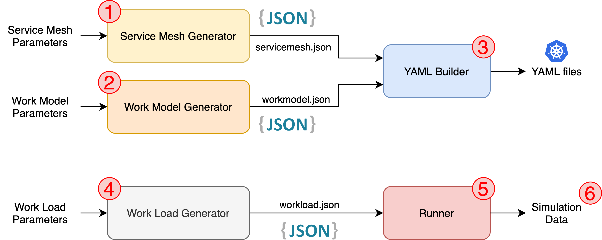
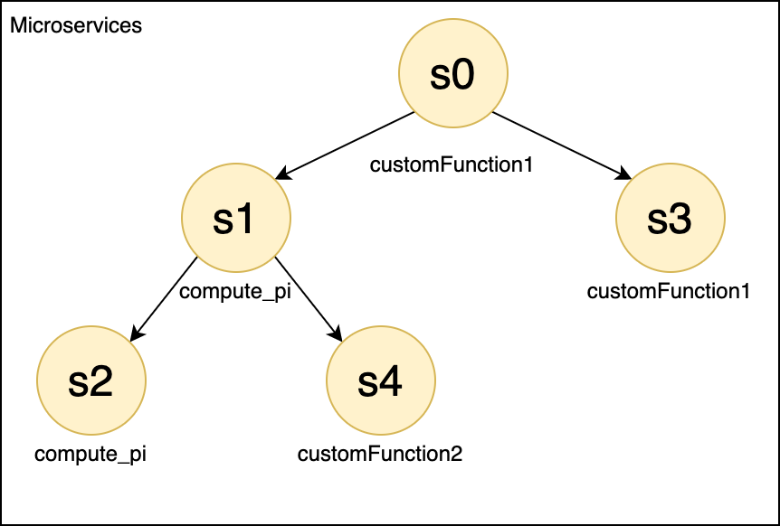

# MicroServiceSimulator

Let's face it. If you ever stumbled upon simulating microservices, you made your life miserable trying.
This project aims at facilitating this process.
Thanks to its modular design you can perform the following steps individually:

1. Create the Microservice Mesh (Service Mesh)
2. Establish the behaviour of each service (Work Model)
3. Combine the Service Mesh and Work Model into K8s deployable YAML files
4. Generate the simulation workload (Work Load Generator)
5. Perform the simulation across the Microservice Mesh
6. Retrieve the simulation data you are interested in and use it for your fancy Machine Learning techniques.

Otherwise, if you have a Kubernetes cluster up and running and feel like deploying the Microservices on it, you can rely on the [AutoPilot](#autopilot) feature, which, as the name suggests, will perform the aforementioned steps automatically for you.

Below we'll try to briefly summarize the main ideas behind this project and how it works, but if you want to dig deeper into the architecture of the MicroServiceSimulator, you can visit the documentation [here](#PathToDocumentation).

---
[comment]: <> (# Unique image CELLLLLLLLLL)

## A brief overview

### Service Mesh Generator
The ServiceMeshGenerator, as the name suggests, generates the mesh that links the services throughout a Microservice.
It takes as input how you want to shape the Microservice:
```json
{
  "services_groups": 1, 
  "vertices": 10, 
  "power": 1, 
  "edges_per_vertex": 1, 
  "zero_appeal": 10
}
```

Output:
```json
{
  "s0": [], 
  "s1": [{"services": ["s0"], "seq_len": 1}], 
  "s2": [{"services": ["s0"], "seq_len": 1}], 
  "s3": [{"services": ["s0"], "seq_len": 1}],
  ...
}
```
        
### Work Model Generator
Ok, so now you made you've built your nice Service Mesh, now what? Now you can assign which job a service must execute when called. You can write your own CPU specific jobs or use the default ones like the `computePi`, that keeps busy the CPU depending on the specified complexity.

Also, you can specify a set of functions followed by their likelihood to be chosen, to give a random spin to your simulation:

```json
{
  "compute_pi": {"probability": 1, "mean_bandwidth": 11, "range_complexity": [1, 250]}, 
  "functionName": {"probability": customProbability, "customParameter": customValue}
}
```




### Work Load Generator
The WorkLoadGenerator maps the simulation time steps with the services, or rather, with the probability a certain service may execute its job.
maps the 

```json
[
  {"time": 0, "services": {"s1": 1, "s2": 0.8}},
  {"time": 2, "services": {"s1": 1}},
  {"time": 5, "services": {"s1": 1, "s2": 0.8}},
  {"time": 7, "services": {"s1": 0.3, "s4": 0.5}},
  {"time": 9, "services": {"s1": 1, "s2": 0.8}},
  {"time": 10, "services": {"s4": 1, "s7": 0.2}}
  ...
]
```

### Kubernetes
Up to now, the deploying part of this simulator requires Kubernetes, but the availability can be expanded in the future. 

#### K8s Yaml Builder
The K8sYamlBuilder translates the Service Mesh and the Work Model files into K8s deployable YAML files.
In particular, it creates one YAML per service with its `Deployment` as well as its `Service` inside the directory `yamls` at its path.

```zsh
host@hostname:~/MicroServiceSimulator/Kubernetes/K8sYamlBuilder/yamls$ ls
MicroServiceDeployment-s0.yaml
MicroServiceDeployment-s1.yaml
MicroServiceDeployment-s2.yaml
MicroServiceDeployment-s3.yaml
MicroServiceDeployment-s4.yaml
...
```

[comment]: <> (#### K8s Deployer)

### Runner

---
### Autopilot
todo

---
* Configurare NFS Server su masterNode
### Configure NFS Server
The MicroServiceSimulator use the NFS Server to share the configuration files between services, in particular 
the nfs shared directory contains the work model and service mesh files, and a directory with the optional
internal job functions.

#### Install NFS Server
For simplicity and compatibility with the AutoPilot script. 
1. We will install the **nfs-kernel-server** package on the master node.
```
sudo apt update
sudo apt install nfs-kernel-server
```

2. We will be creating a directory that will be shared among client systems and we grant all permission to the 
   content inside the directory and the directory itself. 
   This is also referred to as the export directory and it’s in this directory that we shall 
   later create files which will be accessible by client systems.
```
sudo mkdir -p /mnt/MSSharedData
sudo chown nobody:nogroup /mnt/MSSharedData
sudo chmod 777 /mnt/MSSharedData
```

3. Edit the */etc/exports* file to grant the permissions for accessing the NFS server
```
/mnt/MSSharedData pod_subnet(rw,sync,no_subtree_check,no_root_squash,insecure)
/mnt/MSSharedData node_subnet(rw,sync,no_subtree_check,no_root_squash,insecure)
```
Edit this two params according to your configuration:
* **pod_subnet:** Subnet of K8s nodes (e.g. 10.3.0.0/24)
* **node_subnet:** Subnet of K8s pods (e.g. 10.244.0.0/16)

4. Finally export the NFS share directory and restart the NFS kernel server for 
   the changes to come into effect
```
sudo exportfs -a
sudo systemctl restart nfs-kernel-server
```

---
* Gen ServiceMesh
* Gen WorkModel
  
* Copiare ServiceMesh, WorkModel e JobFunctions nella cartella dell'NFS

    * Avviare K8sYamlBuild
    * kapp yaml/PersistentVolumeMicroService.yaml
    * kapp yaml/ConfigMapNginxGw.yaml
    * kapp yaml/DeploymentNginxGw.yaml
    * kapp K8sYamlBuild/yamls/

* Interrogare nxgin gateway -> http://IP_CLUSTER:31113/SERVICE_NAME (es. http://n1:31113/s0, 
  http://n1:31113/s1 ...)