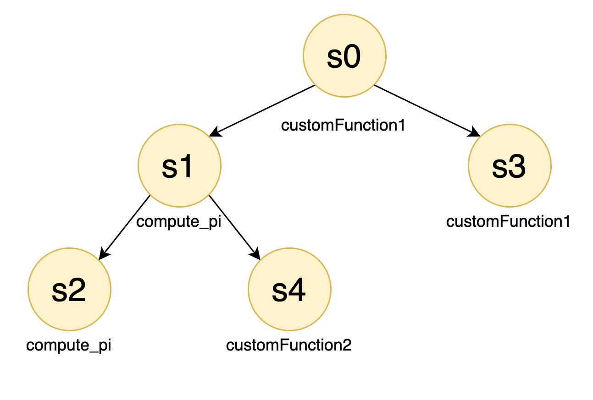

# MicroServiceSimulator

Let's face it. If you ever stumbled upon simulating microservices, you made your life miserable trying.
This project aims at facilitating this process.
Thanks to its modular design you can perform the following steps individually:

1. Create the Microservice Mesh (Service Mesh)
2. Establish the behaviour of each service (Work Model)
3. Combine the Service Mesh and Work Model into K8s deployable YAML files
4. Generate the simulation workload (Work Load Generator)
5. Perform the simulation across the Microservice Mesh
6. Retrieve the simulation data you are interested in

Otherwise, if you have a Kubernetes cluster up and running and feel like deploying the MSS on it, you can rely on the [AutoPilot](Docs/Autopilot.md) script which, as the name suggests, will perform the aforementioned steps automatically for you.

Below we'll try to briefly summarize the main ideas behind this project and how it works, but if you want to dig deeper into the architecture of the MicroServiceSimulator, you can visit the [documentation](Docs).

---
## A brief overview


### Service Model Abstraction
Upon a service request, each service locally executes an **internal-service** and then carries out a set of calls towards **external-services**. An internal-service is a task that user can define as a python function to be inserted in the `/mnt/MSSharedData/JobFunctions` (see also [here](Docs/NFSConfig.md)). However, each service has a pre-defined internal-service that is named `compute_pi`.

External services are grouped into a configurable number of groups (`service_groups`). Services from different groups are called in parallel; services from the same group are called sequentially. To mimic random paths on the service mesh, not all external services of a `service_group` are called, but only a subset of them, whose number is `seq_len` and these are chosen randomly (uniform distribution) from those in the `service_group`. 


### Service Mesh Generator
The ServiceMeshGenerator generates a files that descibes the mesh of the microservice that links the services throughout a Microservice Application.
It takes as input how you want to shape the Microservice:




```json
{
  "external_service_groups": 1, 
  "vertices": 5, 
  "power": 1, 
  "zero_appeal": 10
}
```


Output:
```json
{
  "s0": [{"services": ["s1", "s3"], "seq_len": 1}], 
  "s1": [{"services": ["s2", "s4"], "seq_len": 1}], 
  "s2": [], 
  "s3": [],
  "s4": []
}
```
---
### Work Model Generator
Now, after you've built your Service Mesh, you can assign which job a service must execute when called. 
You can use your own specific jobs to stress the aspect you whish to simulate: CPU, memory or storage.
Or, you can use `computePi`, the default job to keep the CPU busy depending on the indicated complexity of operations.

Also, you can specify the path to your set of jobs followed by their likelihood to be chosen, to give a random spin to your simulation. To know more about how to write your custom jobs you can go [here](Docs/CustomJobs.md). 

```json
{
  "compute_pi": {"probability": 1, "mean_bandwidth": 11, "range_complexity": [1, 250]}, 
  "jobName": {"probability": "customProbability", "customParameter": "customValue"}
}
```

---
### Work Load Generator
The WorkLoadGenerator maps the simulation time steps (in ms) with the services, or rather, with the probability a certain service may execute its job.

```json
[
  {"time": 0, "services": {"s1": 1, "s2": 0.8}},
  {"time": 2, "services": {"s0": 1}},
  {"time": 5, "services": {"s1": 1, "s2": 0.8}},
  {"time": 7, "services": {"s1": 0.3, "s4": 0.5}},
  {"time": 9, "services": {"s1": 1, "s2": 0.8}},
  {"time": 10, "services": {"s4": 1, "s7": 0.2}}
]
```
---
### Kubernetes
Up until to now, the deploying part of the MSS requires Kubernetes, but the availability can be expanded in the future. 

#### K8s Yaml Builder
The [K8sYamlBuilder](Kubernetes) comines the `servicemesh.json`, `workmodel.json` and the following input parameters into K8s deployable YAML files:

```shell
prefix_yaml_output_file = "MicroServiceDeployment"
deployment_namespace = "default"
image_name = "lucapetrucci/microservice:latest"
cluster_domain = "cluster"
service_path = "/api/v1"
var_to_be_replaced = {}  # (e.g {"{{string_in_template}}": "new_value", ...} )

nfs_conf = {"address": "10.3.0.4", "mount_path": "/mnt/MSSharedData"}
```

Some changes to the configuration paramteres are mandatory, others optional.
In particular, it is necessary to update the fields regarding the K8s namespace, NFS server address as well as its mounted path, accordingly with your environment.
Concerning the other parameters, we highly suggest changing them only to expert users, since it would require further changes across the code, as well as the rebuilt of the Docker images each services make use of.

As a result, the K8s Yaml Builder creates, on the `Kubernetes/K8sYamlBuilder/yamls` path, one YAML per service with its `Deployment` and its relating `Service`, along with other files useful for the overall deployment of the MSS.

```zsh
host@hostname:~/MicroServiceSimulator/Kubernetes/K8sYamlBuilder/yamls$ ls
ConfigMapNginxGw.yaml
DeploymentNginxGw.yaml
MicroServiceDeployment-s0.yaml
MicroServiceDeployment-s1.yaml
MicroServiceDeployment-s2.yaml
MicroServiceDeployment-s3.yaml
MicroServiceDeployment-s4.yaml
PersistentVolumeMicroService.yaml
```

---
### Runner
TODO
#### Requirements

- NFS up and running, more info [here](Docs/NFSConfig.md)
- K8s cluster up and running
