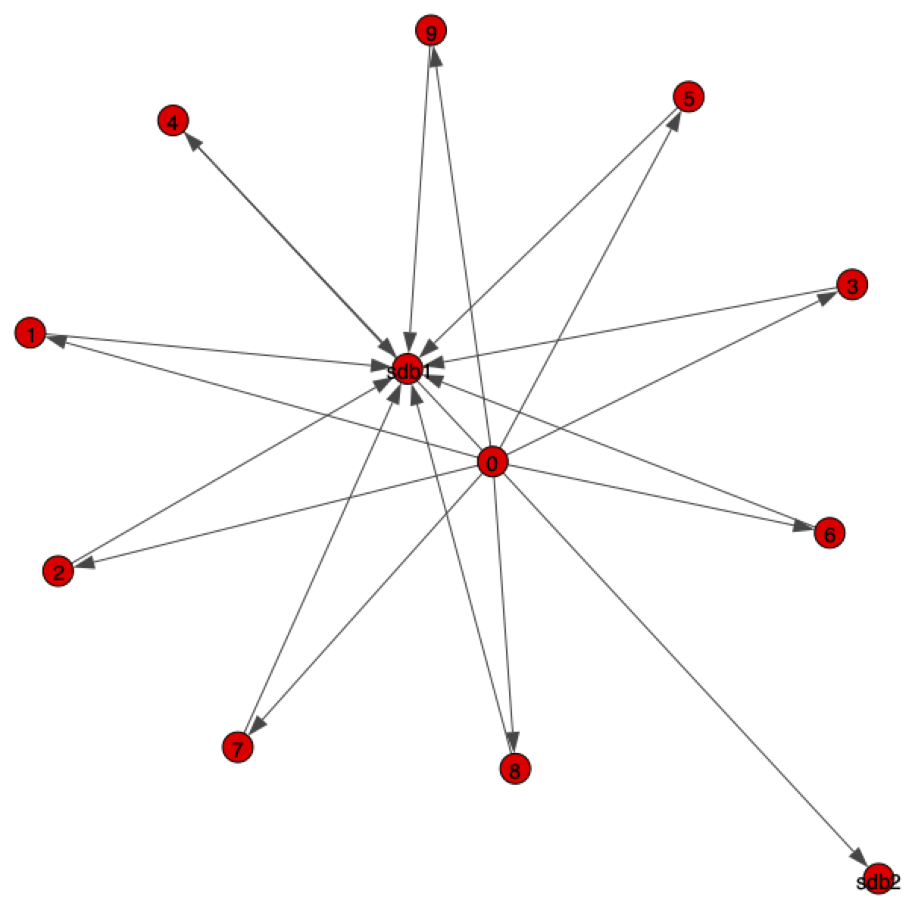
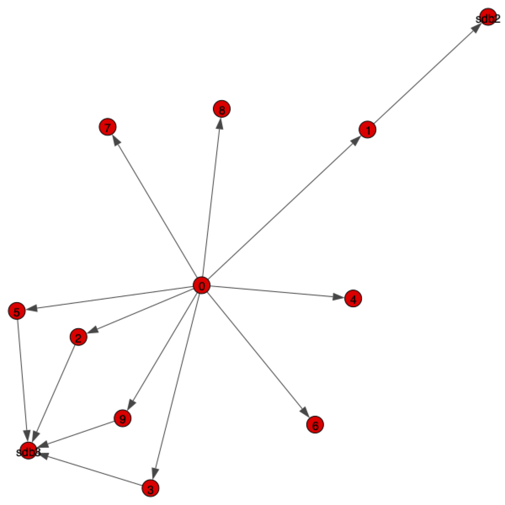
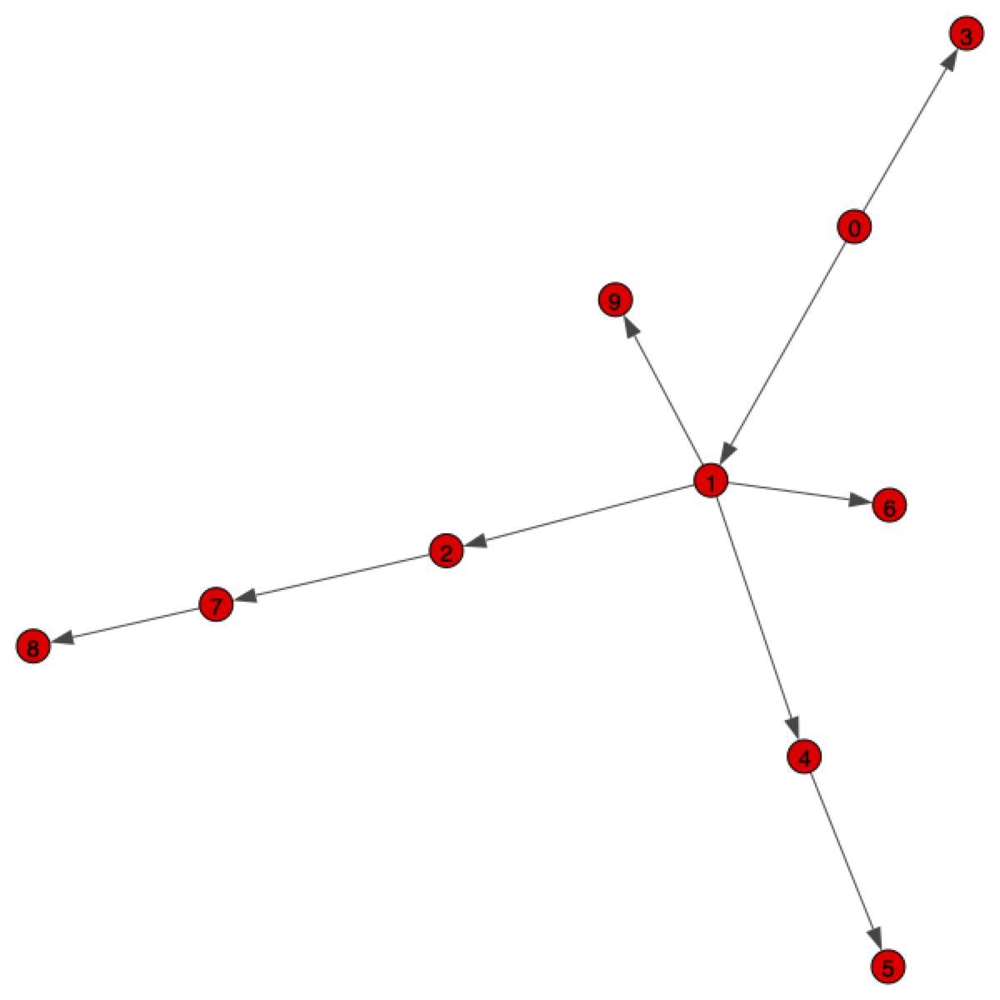
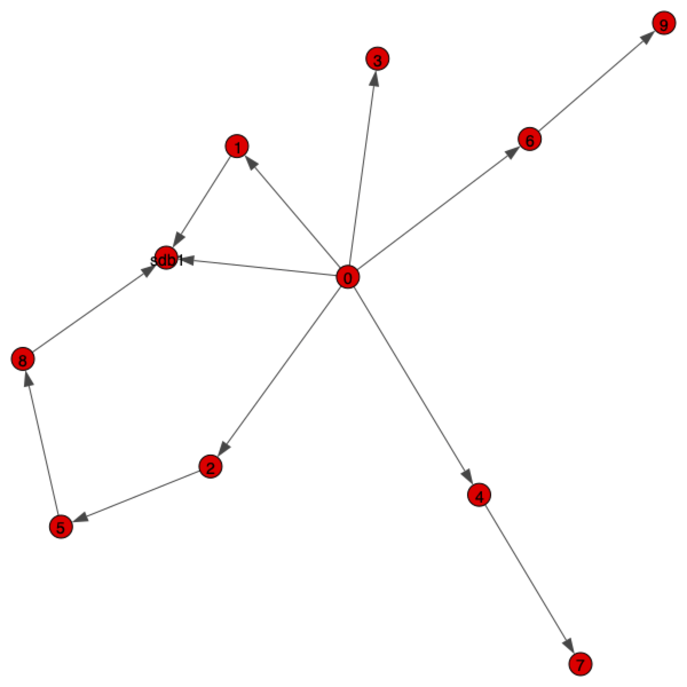

# Service Mesh Generator
Here you can generate the Service Mesh manually.

## Install requirements
First, install the requirements using ``pip``:

```zsh
pip3  install -r /path/to/requirements.txt
```

## Edit input parameters:
Next, edit the ``RunServiceMeshGen.py`` before running it.
It is important to edit the `graph_params_test` parameter, as it describes the generating process of the service mesh.
In particular:

* `services_groups` indicates how many groups of services can be executed in parallel while performing the simulations 
* `vertices` are the number of vertices a service mesh has (db excluded, more later)
* `power` is the exponent of the power law distribution that defines the generation of the service mesh. Essentially, an high value of this parameter imply an higher probability that one vertex is connected to more vertices. 
* `zero_appeal` is the attractiveness of vertices with no edges
* `dbs` is used to specify the presence of db services to the service mesh. You can specify how many dbs as well as the probability a service is attached to one db rathar than another one from the listed dbs; the probabilities are then normalized. Three options are possible:
    1. `"dbs": {}` there are no db services inside the mesh 
    1. `"dbs": {"sdb1": 0.4, "sdb2": 0.6, "sdb3": 0.2}` every service is attached to one of the listed dbs
    1. `"dbs": {"nodb": 1, "sdb1": 0.4, "sdb2": 0.6, "sdb3": 0.2, ...}` similar to the previous example but with the possibility that a service can be attached to none of the listed dbs thanks to the `nodb` probability.
  
For more information on the choice of the parameter you can consider reading the following [research paper]("https://researchcommons.waikato.ac.nz/bitstream/handle/10289/13981/EVOKE_CASCON_2020_paper_37_WeakestLink.pdf?sequence=11&isAllowed=y")

We illustrate four examples of different service mesh topologies:
```
graph_params_test = {"services_groups": 1, "vertices": 10, "power": 0.05, "edges_per_vertex": 1, "zero_appeal": 0.01,
                     "dbs": {"sdb1": 0.4, "sdb2": 0.6, "sdb3": 0.2}}
```



```
graph_params_test = {"services_groups": 1, "vertices": 10, "power": 0.9, "edges_per_vertex": 1, "zero_appeal": 0.01,
                     "dbs": {"nodb": 0.3, "sdb1": 0.4, "sdb2": 0.6, "sdb3": 0.2}}
```



```
graph_params_test = {"services_groups": 1, "vertices": 10, "power": 0.05, "edges_per_vertex": 1, "zero_appeal": 3.25,
                     "dbs": {}}
```



```
graph_params_test = {"services_groups": 1, "vertices": 10, "power": 0.9, "edges_per_vertex": 1, "zero_appeal": 3.25,
                     "dbs": {"nodb": 0.8, "sdb1": 0.4}}
```



## Run the script
Finally, run the script:

```
python3 RunServiceMeshGen.py
```